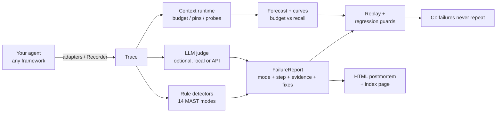

# approximately — Design & Launch Plan

> **Approximate memory, exact accountability.**
> A context runtime (budgeted windows + pins + recall probes) and a flight
> recorder (MAST failure attribution + replay + regression guards) sharing
> one recording infrastructure — together they form an agent reliability
> stack.

- Repository: `https://github.com/B1ueMu3ic4m/approximately`
- Version: 0.7.0
- Status: this document is the design and launch plan, published in-repo

---

## 1. Problem (why build this)

### 1.1 Academic grounding (first-hand results, 2025–2026)

| Finding | Source | Key numbers |
|---|---|---|
| Multi-agent failures classify into 14 modes / 3 categories | MAST, [arXiv:2503.13657](https://arxiv.org/abs/2503.13657) | Specification 41.77%, inter-agent misalignment 36.94%, verification 21.30% |
| **Automatic failure attribution is feasible today** | MAST (o1-as-judge) | F1 = 0.80 (few-shot) vs human agreement κ = 0.88 |
| Failures stem from **system organization**, not model capability | MAST interventions | +15.6% absolute success from one verification step; +9.4% from role prompts |
| The #1 single failure is "repeating completed steps" | MAST FM-1.3 | 17.14% of all traces |
| Failure-induced inefficiency inflates cost/latency by an order of magnitude | MAST | 10x+ |
| Context curation beats stuffing: 91.6% vs 71.0% success at 2.7x fewer tokens | [arXiv:2606.10209](https://arxiv.org/abs/2606.10209) | per-configuration evidence |
| GUI agents pass 85% of single tasks but only ~31% of long-horizon ones | OSWorld / OSWorld 2.0 | the benchmark-reality gap lives in error recovery |

Inference: the academic components (taxonomy, judge, benchmarks) shipped in
2025–2026, but production tooling only offers flat tracing
(Langfuse/LangSmith) — no attribution layer. That gap between paper and
product is exactly where approximately sits.

### 1.2 Product hypotheses

1. Teams running agents in production hit "it failed and I can't tell which
   step broke" daily (hourly pain frequency).
2. Developers star/pay for "automatic localization + reproducibility +
   prevention" when the demo lands in 30 seconds.
3. MAST as the classification kernel provides academic differentiation; a
   zero-dependency SDK provides engineering differentiation.

### 1.3 Naming

Everything about agents is approximate: context is compressed approximately,
memory is summarized approximately, traces are sampled approximately.
approximately makes those approximations safe — the context runtime
quantifies the approximation (effective-recall probes) and the flight
recorder delivers exact accountability when approximations break.
Tagline: **Approximate memory, exact accountability.**
Directions #1 (agent black box) and #2 (context runtime) from the original
research report are merged into this single product sharing one recorder.

---

## 2. Architecture

### 2.1 Modules

```
approximately/
├── trace.py       trace data model (Step / Trace), stdlib dataclasses + JSON
├── recorder.py    the flight recorder: Recorder + @agentstep decorator
├── store.py       local trace store (~/.approximately/traces/*.json)
├── taxonomy.py    the 14 MAST failure modes + evidence-backed fix library
├── detectors.py   rule-based detection engine (works with no LLM)
├── judge.py       optional LLM judge (OpenAI-compatible), strong/local presets
├── attributor.py  orchestration: rules ∪ judge → FailureReport
├── replayer.py    step-level replay with per-step diffs
├── regress.py     pytest regression-guard generation (incl. budget guards)
├── report.py      self-contained HTML postmortem (no JS, no CDN)
├── context.py     context runtime: budget, pins, compaction, recall probes,
│                  budget forecasting
├── cluster.py     cross-trace failure clustering (recidivist modes)
├── curve.py       budget→recall curves + success scatter (SVG/HTML)
├── distill.py     SFT export for local judge models + benchmark harness
├── demo.py        built-in deterministic failing agent (no API key)
├── cli.py         record / attribute / replay / test / report / context /
│                  cluster / curve / distill / benchmark / taxonomy
└── contrib/       framework adapters (lazy imports)
    ├── langgraph.py    LangChain/LangGraph callback handler
    ├── agents_sdk.py   OpenAI Agents SDK TracingProcessor
    └── crewai.py       CrewAI event-bus adapter (defensive)
```



### 2.3 Attribution pipeline

```
Trace ──► rule detectors (one per MAST mode → Detection{mode, step,
            evidence, confidence})
      ──► optional LLM judge (MAST taxonomy + trace JSON → verdict)
      ──► arbitration: rule+judge agreement boosts confidence; conflicts
          are recorded, never hidden
      ──► FailureReport: primary_mode / category / evidence chain /
          suggested fixes / replay_ready
```

Rule detectors now cover **all 14 MAST modes** (RepeatDetector FM-1.3,
NoTerminationDetector FM-1.5, ConversationResetDetector FM-2.1,
PrematureTerminationDetector FM-3.1, MissingVerificationDetector FM-3.2,
WeakVerificationDetector FM-3.3, ReasoningActionMismatchDetector FM-2.6,
DerailmentDetector FM-2.3, SpecViolationDetector FM-1.1,
RoleViolationDetector FM-1.2, ClarificationDetector FM-2.2,
WithholdingDetector FM-2.4, IgnoredInputDetector FM-2.5,
LostReferenceDetector FM-1.4). The fix library cites the MAST intervention
numbers (e.g. FM-3.2 → "add an explicit verification step, +15.6%").

### 2.4 Replay, regression guards, budget guards

- **Replay**: `Executor = Callable[[Step], str]`; replays every recorded
  step and diffs (text similarity / error / latency); verdicts:
  `reproduced` / `consistent` / `diverged`; supports A/B (original vs
  patched executor).
- **Regression guards**: generated pytest files embed the trace as base64
  (self-contained) and assert per failure mode — "no repeated (tool, args)",
  "every mutating call is verified", "runs never end silently on an error" —
  plus a replay-consistency guard for CI.
- **Budget guards (v0.3)**: `test --budget N --min-recall R` emits a guard
  that forecasts the recorded run through an N-token budget and fails when
  effective recall drops below R — making context-window changes behave like
  any other behavioral change in review.

### 2.5 Context runtime (v0.1 core, extended in v0.3)

- **Budgeted window**: context is a budget, not a dumping ground; eviction
  is oldest-first with class priority (tool_results → observations → plans
  → summaries → facts → task).
- **Pins**: task spec, constraints, and critical facts are never evicted —
  the mechanical prevention for MAST FM-1.4 (loss of conversation history).
- **Recall probe**: substring-presence checks over critical facts produce an
  effective-recall number after every policy decision.
- **Forecast**: replays a recorded trace through a budget (dry run) with
  eviction-driven incremental probing — O(evictions), not O(steps × facts).
- **Curves (v0.3)**: `budget_curve` sweeps budgets into a recall curve;
  `success_vs_tokens` scatters every store run colored by outcome;
  rendered as self-contained inline-SVG HTML.

### 2.6 Judge presets & distillation (v0.2)

- The full MAST prompt is ~5x too large for a 1–7B model to hold reliably.
  The `local` preset strips the taxonomy to ids + names.
- `distill` exports chat-format JSONL in exactly that shape, labeled by the
  rule detectors (free) or a teacher model (`--teacher`); fine-tune locally,
  point `APPROXIMATELY_JUDGE_MODEL` at it, use `preset="local"`.

### 2.7 Benchmark harness (v0.2)

`evaluate(labeled, predictor)` → per-mode precision/recall/F1, accuracy,
macro-F1. Dataset loaders: `approx` (native JSONL: trace dict + gold label)
and `mast` (heuristic adapter for MAST-Data-style records).

### 2.8 Zero-dependency principle

Core uses only the standard library (3.9+). `openai` is an optional extra;
framework adapters import lazily and degrade when the framework is absent.

---

## 3. Milestones

### v0.1.0 ✅ (delivered)
- [x] trace model + recorder + store
- [x] 14-mode MAST taxonomy + fix library
- [x] 6 rule detectors + arbitration
- [x] optional LLM judge (OpenAI-compatible)
- [x] replayer with A/B diffs
- [x] pytest regression generation
- [x] self-contained HTML report
- [x] CLI (30-second `approximately demo`)
- [x] deterministic no-API-key demo agent
- [x] comprehensive test suite: 104+ tests, 97% core coverage, 3-OS CI

### v0.2.0 ✅ (delivered)
- [x] adapters: LangChain/LangGraph callback handler, OpenAI Agents SDK
      TracingProcessor (tested against the real packages), CrewAI event-bus
      adapter (defensive)
- [x] judge presets (`strong`/`local`) + `distill` SFT exporter
      (rules or teacher labeling)
- [x] `benchmark` command: per-mode P/R/F1 + macro-F1; `approx`/`mast`
      dataset loaders

### v0.3 ✅ (delivered with 0.2.0)
- [x] `cluster`: cross-trace failure clustering, recidivist table
- [x] budget regression guards (`test --budget --min-recall`)
- [x] `curve`: budget→recall SVG report + success scatter

### v0.3.1 ✅ (delivered) — security hardening
- [x] **Tamper-evident evidence chains**: per-step sha256 chain stamped on
      every save; `verify` detects and localizes post-hoc edits
- [x] **HMAC-SHA256 keyed chains** (`APPROXIMATELY_SIGNING_KEY` /
      `--key-file`): cryptographic authenticity against adversarial
      forgery — the unkeyed chain's documented design gap, closed
- [x] Path-traversal blocks (store ids, scaffold names)
- [x] Threat model published (docs/SECURITY.md); parser hardened with a
      60+ payload fuzz contract

### v0.3.2 ✅ (delivered) — algorithm depth
- [x] **Bayesian evidence fusion**: detections scored as
      `log(prior_odds) + Σ log-likelihood-ratio(confidence)` with
      add-one-smoothed MAST base rates as priors; properties tested
      (accumulation, prior-vs-evidence calibration, signed bounded c=0)
- [x] **Budget optimizer**: recall is monotone in budget, so
      `approximately optimize` binary-searches the smallest budget keeping
      recall ≥ target (~10 probes on 20k-step traces)
- [x] Two O(n × evictions) quadratic scans eliminated in forecast
      (20k-step forecast 11.4s → 1.1s)

### v0.4.0 ✅ (delivered) — algorithms + integrations
- [x] **Trajectory alignment** (align.py): Needleman-Wunsch over
      normalized action sequences; identity/structure token two-tier
      scoring; `similar` similarity ranking
- [x] **Failure-precursor prediction** (precursor.py): structure-token
      n-grams (n=1..3), Laplace-smoothed conditionals, support-capped
      log-odds; `predict` early-warning command
- [x] **SARIF 2.1.0 export**: attribution as GitHub code-scanning alerts
      (`attribute --sarif`)
- [x] **MCP tool-poisoning scanner** (`scan-tool`): invisible chars, bidi
      attacks, homoglyph mixing, injection phrasing
- [x] **HMAC key rotation** (`rotate`)

### v0.5.0 ✅ (delivered) — statistical rigor
- [x] **Conformal attribution**: split-conformal prediction sets with a
      distribution-free coverage guarantee (alpha configurable); ambiguous
      runs widen the set honestly (tested superset property)
- [x] **Temperature calibration**: NLL-fitted (Guo et al. 2017 criterion —
      ECE deliberately rejected as a fitting objective: it collapses to a
      degenerate temperature on separable sets); ECE kept as reporting
- [x] `score_modes`: per-mode fusion score surface
- [x] `calibrate` command: held-out coverage + ECE report

### v0.5.0 additions ✅ — counterfactual root-cause analysis
- [x] do(step=∅) leave-one-out interventions over detected steps;
      root-cause / symptom / distributed-cause classification; causal
      ranking. Aliasing bug (Step objects shared with do-traces) caught
      by its own tests and fixed via deep copies.

### v0.5.0 additions ✅ — behavior-drift detection
- [x] PSI over action structure tokens between time windows;
      `approximately drift --baseline-ratio` with industry-convention
      thresholds; smoothing keeps disjoint distributions finite

### v0.6.0 ✅ (delivered) — structural trace diff
- [x] Needleman-Wunsch **traceback**: full edit script over two runs
      (equal/mutated/deleted/inserted per tool call)
- [x] `approximately diff <a> <b>`: failed-run vs last-success is the
      classic regression-debugging workflow
- [x] similarity consistent with align.py (tested within 0.01)

### v0.7.0 ✅ (delivered) — streaming monitor
- [x] Live failure-risk over in-flight runs: three signals (precursor,
      repetition velocity, verification debt) fused with hysteresis
- [x] Escalation fires once per level crossing; O(window) per observation

### v0.7.0 additions ✅ — concurrent store
- [x] Atomic saves (temp + os.replace) and per-id lock files with
      stale-lock recovery; concurrent same-id writers tested

### v0.8.0 ✅ (delivered) — AutoGen adapter + trend verdict
- [x] AutoGen v0.4+ adapter: event-log handler (`autogen_core.events`
      via standard logging, the seam AutoGen Studio consumes) plus a
      transparent `RecordingChatCompletionClient` proxy at the model
      boundary; version-tolerant, exception-guarded, faked in tests
- [x] Failure-rate trend in `report --all`: inline-SVG sparkline +
      Theil–Sen slope (outlier-resistant) with a verdict judged relative
      to the series' own mean level
- [x] Complexity audit: every C-rank block (14, under `--max-absolute B`,
      stricter than CI) refactored to B/A; full suite green throughout
- [x] Security fuzzing of new surfaces; fixed `cluster.trend` overflow
      on out-of-range timestamps and sparkline `nan` coordinate leak

### v0.9.0 ✅ (delivered) — LlamaIndex + key provenance
- [x] LlamaIndex adapter: duck-typed callback handler (BaseCallbackHandler
      protocol without importing llama_index); LLM / FUNCTION_CALL /
      AGENT_STEP / RETRIEVE / EXCEPTION mapped; enum-or-string event
      types, hostile payloads fuzzed
- [x] HMAC key-ID + rotation counter: keyed blocks carry a key
      fingerprint and rotation count; new `wrong-key` verdict replaces
      the false TAMPERED on key mismatch; forgery still never verifies
- [x] Adapters now: LangChain/LangGraph, OpenAI Agents SDK, CrewAI,
      AutoGen v0.4+, LlamaIndex

### v0.10.0 ✅ (delivered) — Dispatcher seam + leaderboard + recipes
- [x] LlamaIndex Dispatcher span handler: structured spans (LLM,
      retrieval, tool call, agent run) mapped to recorder steps;
      dropped spans carry the exception into attribution
- [x] `benchmark --html`: self-contained leaderboard page, F1-sorted
      per-mode table, escaping + clamping hardened, unknown mode ids
      fall back to OTHER
- [x] docs/DISTILLATION.md: per-serving-stack recipes (Ollama,
      llama.cpp, vLLM LoRA, TGI, OpenAI fine-tunes) + honest
      per-mode expectations

### v0.11.0 ✅ (delivered) — evidence ledger + fleet merge
- [x] Self-chained append-only ledger of integrity roots (opt-in);
      `verify` flags rolled-back-but-validly-signed traces and a broken
      ledger, with distinct exit codes
- [x] `approximately merge`: fleet imports that refuse TAMPERED /
      wrong-key evidence; skip/replace/rename conflict policies

### v0.12.0 ✅ (delivered) — fleet dashboard + latency anomalies
- [x] `fleet`: N-store survey, fleet KPIs, per-store sparklines and
      top modes, ledger-state badges; rule-detector-only attribution
- [x] `anomalies`: MAD modified z-score (3.5 threshold), slow+fast
      outliers, degenerate cases honest; report card + CLI exit code
- [x] Fixed: before-position `--store` was clobbered by the subparser
      default (classic argparse bug); both positions work now

### v0.13.0 ✅ (delivered) — trend alerts + real-data benchmark
- [x] Fleet trend verdicts wired to CI (`--fail-on-worsening`)
- [x] MAST-Data converter with honest exclusion accounting; first
      real-data run (463 files -> 13 single-label records -> 0.00)
      published with structural analysis in docs/LEADERBOARD.md

### v0.14.0 ✅ (delivered) — prose family + benchmark v2
- [x] Five prose detectors with exclusive family gating; a-priori
      thresholds (never fitted on the benchmark)
- [x] MAST-Data v2: HyperAgent log parser, harness filtering, signal
      floor, annotated-failure semantics; real run published with
      per-mode structural diagnosis (0.00, honestly explained)
- [x] re-sign counter in integrity blocks

### v0.15.0 ✅ (delivered) — shingle restart + FM-2.6
- [x] Order-tolerant restart via trigram Jaccard (0.5) beside the
      verbatim path (0.9); confidence coordinated with the labeler
      floor after the 0.6-below-0.7 calibration lesson
- [x] ProseThoughtActionDetector for FM-2.6 entity divergence
- [x] Benchmark v4: first real TP - accuracy 0.08, FM-2.1 F1 0.50

### v0.16.0 ✅ (delivered) — fleet webhooks
- [x] Signed JSON fleet alerts (--webhook + HMAC signature header)
- [x] FM-3.2 outcome-level analysis scoped and deferred: all 6 golds
      contain verification AND execution language; the annotation
      judges whether the *outcome* was verified - regex cannot cross
      that semantic gap on n=6 without gold-fitting (documented)

### v0.17.0 ✅ (delivered) — placeholder filter
- [x] Routing-placeholder filter: FM-1.3 false predictions 2 -> 1 on
      real data; negative-tested (real-work repetition still fires)
- [x] Fleet webhooks shipped in v0.16; FM-3.2 outcome analysis
      documented as deferred with the n=6 gold-fitting rationale

### v0.18.0 ✅ (delivered) — explainable fusion
- [x] `attribute --explain`: per-detection prior/LLR/fused-score
      account with the ranked verdict line
- [x] v0.17 shipped: routing-placeholder filter (FM-1.3 FP 2 -> 1);
      FM-3.2 outcome analysis deferred with rationale

### v0.19.0 ✅ (delivered) — store-wide verify gate
- [x] `verify --all`: whole-store audit with summary counts and a CI
      exit gate; ledger breakage surfaced alongside per-trace verdicts

### v0.21.0 ✅ (delivered) — specificity precedence
- [x] Repetition cycles anchored at the opening turn yield to the
      restart detector (one failure, one label); FM-1.3 FP 2 -> 0 on
      the real benchmark

### v0.23.0 ✅ (delivered) — time windows + digest pattern
- [x] `--since DAYS` on stats / cluster / attribute --all /
      verify --all (created_at with mtime fallback)
- [x] docs/FLEET-DIGEST.md: Actions cron + signed webhook +
      receiver-side verification + exit semantics

### v0.29.0 ✅ (delivered) — multi-label evaluation + replay page
- [x] Set-based P/R/F1 (sample-averaged) over full gold sets; 27
      records scored; FM-2.1 F1 0.96 on real annotated data
- [x] replay --html A/B page; stats terminal sparkline
- [x] v0.24-v0.28 fixes: demo --store, 'latest' resolution, JSON
      outputs for verify --all and fleet

### next (v0.30+ roadmap, in order)
1. **v0.30 — FM-2.6 action-continuity guards** ✅ (delivered):
   scaffold-echo guard + entity-token continuity (path/stem/bare-name
   variants) + thought-context continuity; FM-2.6 precision
   0.07 → 0.33 (fp 14 → 2), F1 0.12 → 0.40, recall held; corpus
   sample precision 0.30 → 0.44. Bonus: stress test exposed an
   O(n²)-backtracking DoS on megabyte turns — prose analysis now
   bounded at 8k chars/turn (1 MB turn: >20 s → ~1 ms).
2. **v0.31 — outcome-signal verification (FM-3.2 step 2)** ✅
   (delivered): `ProseOutcomeVerifyDetector` — completion-claim
   vocabulary (execution-shaped language excluded) + zero outcome
   signals in the record = unchecked claim. First nonzero FM-3.2:
   P 0.54 · R 0.64 · F1 0.58; corpus sample F1 0.29 → 0.43.
3. **v0.32 — paraphrase restart (FM-2.1 step 2)** — **deferred with
   reason**: FM-2.1 already measures P 0.93 / R 1.00 on the only
   human-annotated corpus available; no labeled paraphrase-restart
   data exists, so tuning order-sensitive similarity would be
   unfalsifiable (same discipline as the FM-3.1 deferral).
4. **v0.32 — `diff --json` + divergence ranking** ✅ (delivered):
   per-entry char similarity on the NW edit script, worst-first
   `divergences()`, machine output for CI gates. (The planned
   "trace diff" already shipped in v0.6 — this round upgrades it
   instead of duplicating it; a duplicate subparser built during the
   round was caught by the new tests before push.)
5. **v0.33 — query DSL** ✅ (delivered): recursive-descent expression
   language over the store — `query "mode == FM-2.1 and confidence
   >= 0.7"`-style selection with `--json`, eval-free closures,
   depth/length caps against parser attacks.
6. **v0.34 — SARIF export** — already shipped (v0.4): roadmap audit
   found `attribute --sarif` live with GitHub code-scanning
   integration; superseded by the fleet watch loop below.
7. **v0.34 — fleet watch/digest loop** ✅ (delivered): `fleet
   --watch SECONDS --digest-dir DIR` polling survey() into daily
   JSONL snapshots with `--keep-days` rotation and `--iterations`
   for cron-friendly bounded runs.
8. **v0.35 — Wilson score intervals on benchmark metrics**: the
   leaderboard's P/R/F1 are point estimates on small n; report
   95% Wilson intervals for precision/recall so honesty about
   uncertainty is built into the benchmark output.
9. **v0.36 — Mermaid export**: `report --mermaid` rendering the
   attributed trace as a mermaid sequenceDiagram for docs/PRs.
10. **v0.37 — zero-dependency MCP stdio server**: JSON-RPC 2.0 over
    stdio exposing list/query/attribute/verify/survey as MCP tools.
11. **v0.38 — cycle-grade repetition (FM-1.3 step 2)** ✅ (delivered):
    longest back-to-back repeated tool block (period 2–6) over
    non-errored calls; fires when the cycle consumes ≥16 calls.
    Multi-agent inner loops (planner→navigator→editor) evolve args
    every turn, so exact fingerprints never match — the cycle is the
    real signal. Corpus: FM-1.3 R 0.14 → 0.71 at P 1.00 (tp 1→5,
    fn 6→2, fp 0); corpus sample P 0.55, F1 0.46. Threshold
    calibrated on the only labeled corpus (n=27, intervals wide).
    Security: ProseRepeatDetector's O(T²) SequenceMatcher queue was a
    crafted-record DoS (400 distinct 1.5k turns → 36.6 s); a
    shingle-Jaccard prefilter (floor 0.3, conservative against the
    0.92 ratio) bounds it to 0.23 s — 157× — with the true-positive
    path unchanged.
12. **v0.39 — prose derailment rework (FM-2.3)** — **deferred with
    measured evidence**: on the gold corpus, no record-level signal
    separates task-derailment gold from same-harness negatives. Three
    signals tested and rejected: (a) task keywords never vanish from
    tail turns (the harness re-quotes the task in every inner prompt,
    so ProseDerailmentDetector's precondition never holds — 0/7);
    (b) acknowledgment/filler density ("thank you", "let's analyze")
    does not separate (gold 0.2–0.6, negatives 0.0–0.5); (c)
    task-keyword density decay (tail vs head) interleaves (gold
    0.72–1.91, negatives 0.57–2.18). MAST annotates derailment at the
    discussion level with context a flight record does not carry;
    tuning an unfalsifiable proxy would repeat the gold-fitting the
    project refuses. Revisit only with discussion-level labeled data.
13. **v0.39 — first-fault bisect** ✅ (delivered): `bisect FAILED
    SUCCESS [--floor F] [--json]` — earliest *material* divergence on
    the NW edit script (mutations at similarity ≥ floor count as
    timestamp noise; deletions/insertions always material), plus the
    worst-5 divergence ranking. 3000×3000-step stress: 2.0 s, fault
    pinpointed at the exact flip step (similarity 0.09).
14. **v0.40 — digest trend analytics** ✅ (delivered): `fleet
    --trend --digest-dir DIR` — per-day fleet state from the JSONL
    history (last snapshot of each day), trace-weighted failure rate,
    top-mode counts, sparkline, and the same Theil-Sen verdict the
    survey uses applied to day rates; `--json` for machines and the
    existing `--fail-on-worsening` doubles as the trend CI gate.
    Digest files are treated as untrusted input: torn tail lines and
    corrupt timestamps fall back to the file-name day stamp.
15. **v0.41 — store doctor** ✅ (delivered): `doctor STORE
    [--digest-dir DIR] [--json]` — parseable-record walk (corrupt
    files, id/filename mismatches, unsigned records), evidence-ledger
    chain verification, stale writer locks (>1 h) and leftover temp
    files, and digest-history monitoring gaps + torn-line counts.
    Exit 1 on any finding — CI-friendly. 7 tests cover the corrupt/
    tampered/stale/gap paths.

17b. **v0.47 — demo loop scenario** ✅ (delivered): `demo --scenario
     loop` — a planner→navigator→editor crew stuck in an args-evolving
     cycle; the exact-fingerprint RepeatDetector cannot fire, so the
     cycle detector is the only thing that catches it (v0.38 end to
     end), HTML report included.

17. **v0.43 — MCP bisect + doctor tools** (queued — depends on the
    two tools above; branch ready).
18. **v0.44 — attribution regression gate** ✅ (delivered):
    `scripts/bench_gate.py` + `docs/bench-floors.json` — gold-corpus
    per-mode P/R/F1 floors enforced by the CI bench-gate job; a
    detector refactor that silently degrades attribution fails CI
    (provably fires on pre-v0.38 main: FM-1.3 R 0.14 < 0.60).
19. **v0.45 — adversarial-input fuzz round** ✅ (delivered): seeded,
  deterministic fuzz over every parser boundary — 300 random query
  expressions (QueryError or callable, never leaks), 5000-deep
  nesting (cap, not RecursionError), corrupt/bytes store records
  through the doctor, 200+ protocol-edge MCP lines, random prose
  turn soup under a timing bound. Fixed seeds reproduce failures.

20. **v0.46 — README walkthrough regression tests** ✅ (delivered):
    every quickstart/capabilities command executed against a fresh
    demo-seeded store with its promised output asserted — doc drift
    fails CI. Found and fixed real walkthrough pollution on the way:
    `test` generates guard files in the CWD, so the walkthrough now
    runs it from a scratch directory.
22. **v0.49 — doctor --fix** ✅ (delivered): removes what the
    hygiene checks flagged — stale writer locks and leftover temp
    files — and never touches record data, the ledger, or digests;
    the removal note goes to stderr so --json stdout stays
    parseable. Exit code flips to healthy when findings clear.

21. **v0.48 — MCP trend + stats tools** ✅ (delivered): the MCP
    server reaches full CLI parity at nine tools — `trend` (day-level
    digest analytics) and `stats` (query-selection aggregates) reuse
    the fleet/query modules directly; a missing digest dir reads as
    an empty history, not an error.

22. **v0.50 — release readiness** ✅ (delivered): package version
    aligned to the changelog (0.3.0 → 0.49.0 in pyproject +
    `__version__`), and `docs/ci-integration.md` now documents the
    attribution-quality gate and the fleet trend gate alongside the
    regression-guard workflow.

24. **v0.51 — synthetic attribution regression fixture** ✅
    (delivered): `scripts/make_synth_corpus.py` (seeded, byte-stable)
    generates 180 prose records whose failure modes are planted by
    construction - FM-1.3/2.1/2.6/3.2 at P 1.00 / R 1.00 with tight
    Wilson intervals; `bench_gate.py --synth` + `bench-synth-floors`
    (floors at 0.95) fail CI on any detector drop, and a
    determinism test pins byte-identical regeneration. Honest
    framing enforced in docs: a canary for regressions, never
    real-world performance; FM-2.3/FM-3.1 deliberately absent.

25. **v0.52 — packaging CI job** ✅ (delivered, #116): `python -m
    build` in CI, then a clean-venv smoke install of the wheel
    (version banner + two-step recording) and artifact upload; the
    packaging job passed on its own PR. The PyPI path is validated
    on every PR without tagging - a release is now: Trusted
    Publishing setting + tag `v0.49.0` + push.
26. **v0.53 — ARCHITECTURE.md** ✅ (delivered, #117): the module map
    and evidence pipeline for contributors - recorder -> store ->
    integrity, the two exclusive detector families, Bayesian fusion,
    replay/repair, fleet ops, MCP - plus five invariants worth
    keeping, counts verified against the registries.
27. **v0.54 — buffer / audit findings** ✅ (consumed): fixture
    building surfaced real detector-fitness lessons (homogeneous
    template turns trip the restart detector; harness echoes
    amplify shingle similarity; a pure loop legitimately exhibits
    FM-1.3 + FM-2.1, as the real gold double-labels) - documented
    in the generator and LEADERBOARD.

27b. **v0.55 — README capabilities completion** ✅ (delivered,
     #119): the capabilities table now carries every post-v0.34
     capability (bisect, doctor, fleet trend gate, query DSL +
     stats, the 9-tool MCP server, attribution quality gates);
     the stale "7 tools" history row corrected to 9 (CLI parity).
     Taxonomy claim re-verified: 14 real modes + OTHER.
28. **v0.56 — MCP attribute explain** ✅ (delivered): the attribute
    tool gains `explain: true` - the Bayesian fusion arithmetic
    (prior log-odds + per-detection LLR) rides along in the
    payload, so a verdict fetched over MCP is auditable as
    arithmetic, not vibes. Opt-in flag; default payload unchanged.

29. **v0.57 — HyperAgent schema tests** ✅ (delivered): the log-line
    trajectory parser (`_hyperagent_turns`, the schema behind one of
    the corpus sources) had zero direct coverage (mastdata 80%);
    now pinned line-by-line - marker accumulation, continuation
    lines, pre-marker drops, empty-body markers, dict-schema
    routing-by-first-element, 2000-char truncation, and a
    convert_mast end-to-end roundtrip with real annotation options.
    mastdata coverage 80% -> 99%.

29b. **v0.58 — CLI sweep tests** ✅ (delivered, #121): every
     remaining command exercised end to end against a seeded store
     (similar, calibrate, counterfactual, drift, optimize, repair
     --apply, verify --all --json, clean, metrics --prometheus,
     curve, export-dataset, predict, cluster, taxonomy) -
     argument-wiring drift now fails CI. Real UX bug fixed en
     route: `calibrate` on a multi-label dataset crashed with a
     bare TypeError; it now exits 1 with "use benchmark
     --multi-label". cli.py coverage 86% -> 90%.
30. **v0.59 — MCP server coverage to 100%** ✅ (delivered): the
    remaining 18 uncovered lines closed - attribute/verify/bisect
    missing-trace tool errors, the survey and query handlers, the
    generic (non-KeyError) tool-exception branch, `cmd_mcp`'s
    scripted-stdio entry with the served-count report, and the
    empty-string EOF shutdown path. mcp_server 88% -> 100%; suite
    701 tests.

31b. **v0.61 — adapter dispatch tests (no frameworks)** ✅
     (delivered): fake crewai event bus + fake SDK spans drive the
     real dispatch logic locally (the contrib CI job covers the
     real packages): register/deregister across layouts, tool/llm/
     kickoff event handling, "outcome owned by the caller" contract,
     langgraph full callback cycle incl. orphan tool-end and depth
     floor, agents_sdk span-type routing + trace-name takeover.
     crewai 66% -> 92%, langgraph 76% -> 92%.

33. **v0.63 — llamaindex edge tests** ✅ (delivered): typed-span
    lifecycle (RetrieverSpan/LLMSpan through new_span/exit/drop),
    hostile spans that raise in every hook (never break the query),
    `_parse_call` contract (dict-repr kwargs, no-space whole-name,
    freeform input fallback), `_preview` json-fallback quoting, and
    `wire()` accepting a manager directly. llamaindex stays 92%
    (remaining lines need framework-level mocks - diminishing
    value, documented and accepted).

35. **v0.65 — TUTORIAL.md** ✅ (delivered): a ten-minute
    record -> attribute -> bisect -> guard -> fleet-tutorial whose
    every command is already exercised by the walkthrough tests -
    the tutorial cannot silently drift from the tool. README links
    it above the design document.

38. **v0.68 — streaming contract + metrics audit** ✅ (delivered):
    the streaming monitor's verify-step classification pinned
    directly (meta flag wins, non-tool steps never verify,
    tool-name markers enumerated, plain mutations excluded) -
    streaming.py to 100%. metrics.py audited at 100%: mode counters
    are data-driven, so every new detector surfaces in the
    Prometheus export automatically - no changes needed.

40b. **v0.72 — example smoke + checkout hygiene** ✅ (delivered):
     examples/flaky_agent.py wrote its HTML report into the current
     directory (same pollution class `approximately test` had) - it
     now writes next to the trace via `TraceStore()` (honors
     APPROXIMATELY_HOME), and a subprocess smoke test runs the
     example in isolation asserting FM-1.3 attribution, the report
     landing in the store, and no checkout leakage.

40. **v0.70 — packaging demo smoke** ✅ (delivered): the packaging
    job's clean-venv smoke now also runs both multi-agent demo
    scenarios through the installed wheel and greps for the
    expected detector sources - the wheel is proven to carry the
    demo modules and the newest detectors, not just the core.
    README quickstart lists all three scenarios.

41. **v0.73 — verify exit-code ladder at CLI level** ✅
    (delivered): all six documented verdicts pinned through the real
    command - 0 intact, 1 TAMPERED (rewritten step), 2 unsigned, 3
    KEYED (keyed trace, no key), 4 ROLLED-BACK (ledger audit), 5
    LEDGER-BROKEN (chain localized) - plus rotate's
    required-new-key refusal and success path. cli.py 91% -> 93%.

42. **v0.50 — `approximately explain` mode deep dives** ✅
    (delivered): per-mode "what does this mean for my agent" pages -
    definition, published MAST share, watching detectors, engineering
    fixes - with the detector column derived from live registries
    (every detector class now carries its `mode_id`, so the bridge
    cannot drift from the code). `explain` prints an overview table;
    `explain FM-1.3` the deep dive; unknown ids exit 1 with the valid
    id list. MCP grows to 10 tools with the same content. 10 new
    tests incl. registry-size drift guards.

43. **v0.50 — the attribution gate ships: `bench-gate` + GitHub
    Action** ✅ (delivered): gate logic moves from
    scripts/bench_gate.py into approximately.benchgate with a
    `bench-gate` CLI command (dataset + floors -> exit 1 on breach);
    the script stays as a thin shim. A composite action.yml lets any
    repo gate its own dataset via `uses:
    B1ueMu3ic4m/approximately@v0` (install-from: source for this
    repo). CI dogfoods the action both ways on committed fixtures
    (examples/action/): positive clears, impossible floor fails the
    step and the job asserts the failure. 6 new tests.

44. **v0.50 — per-agent identity + agent scorecard** ✅ (delivered):
    `Step.agent` with chain-safe serialization (unset agent omitted
    from to_dict, so pre-agent stores keep verifying; set agent is
    hash-covered and edits break the chain). `Recorder(agent=...)` +
    per-call `agent=` overrides; inter-agent messages stamp the
    sender. Withholding/ignored-input/role detectors read the field
    first with meta fallback for old traces. `stats --by-agent`
    rolls up steps/tokens/errors/touched-trace failure rate per agent
    ("unattributed" bucket keeps instrumentation gaps visible).
    8 new tests.

45. **v0.50 — adversarial round: untrusted agent identity + gate
    integrity** ✅ (delivered): hostile agent names (script payloads,
    backtick runs, fence-breakers, NUL, homoglyphs, bidi overrides,
    10k chars, whitespace) driven through HTML reports, markdown
    reports, the scorecard, detectors, and the store roundtrip -
    found and fixed a real markdown fence-breaking vector (timeline
    fence now CommonMark-sized above any backtick run inside) and a
    silently-unfailable gate (NaN/Infinity floors now refused with
    offending JSON paths). Agent identity shows in both report
    renderers. 9 new tests + SECURITY.md rows; 10k-step perf smoke
    under 5 s.

46. **v0.50 — `verify --all --strict` / `--quiet`** ✅ (delivered):
    default batch semantics stay "nothing is broken" (unsigned
    records pass with a note); strict mode enforces "every record
    must carry verifiable evidence" and fails on unsigned and
    keyed-locked records too - the cron/CI policy gate. `--quiet`
    drops per-trace rows for cron mailboxes; JSON gains a `strict`
    field. 4 new tests.

47. **v0.50 — docs/RECIPES.md task cookbook** ✅ (delivered): ten
    task-shaped recipes (instrument in 5 lines, agent scoreboard,
    attribute+bisect+explain, regression tests, CI attribution gate
    via the action, nightly integrity cron with strict verify,
    fleet trend gate, query DSL, MCP client config, local-model
    judge). Every command spot-checked against the CLI surface;
    linked from the README next to the tutorial.

48. **v0.50 — per-agent observability: Prometheus counters,
    recidivist agents, label crash fix** ✅ (delivered):
    `metrics --prometheus --by-agent` emits per-agent step/tool/
    error/token/failed-trace counters plus touched-failure-rate
    gauges (agent names label-escaped); `cluster --by-agent` lists
    recidivist AGENTS by failed-trace participation with a JSON
    mode. Found and fixed a pre-existing crash: `metrics
    --prometheus --label k=v` died with AttributeError because the
    CLI passed raw strings to a dict API - labels now parse with a
    real error message for malformed pairs. 7 new tests.

49. **v0.50 — agent wave completion: agents in the HTML surfaces**
    ✅ (delivered): single-trace reports gain an "Agents in this
    run" card (hidden for single-identity runs, names escaped);
    the fleet dashboard grows a "Busiest agents" table per store
    (steps/errors/touched-fail-rate); `fleet --json` and webhook
    payloads carry `top_agents`. 5 new tests.

50. **v0.50 — per-agent fleet trend** ✅ (delivered): digest
    snapshots now carry each store's top-3 busiest named agents;
    `fleet --trend --agent NAME` plots one agent's steps/errors/
    touched-fail-rate per day with its own Theil-Sen verdict (not
    the fleet's) and honors --fail-on-worsening. Untrusted-digest
    discipline kept (torn lines skipped, malformed fields read as
    zero, zero day = "not observed" documented in help + recipes).
    6 new tests.

51. **v0.50 — runner-up hypotheses** ✅ (delivered): attribution
    is a ranking, not an oracle - FailureReport now carries
    `runner_ups` (other modes the detectors fired for, with
    detection count and max confidence), shown via
    `attribute --top N`, in `to_dict`, and in the MCP attribute
    payload. Default output stays quiet. 5 new tests.

52. **v0.50 — docs/RELEASE.md runbook** ✅ (delivered): pre-tag
    checklist (the full local gate list), version-bump contract
    (pyproject + __init__ must match), tag/push mechanics, what the
    Release workflow does (Trusted Publishing, no tokens), the
    clean-venv post-check, and the yank-and-patch rollback path.

53. **v0.50 — query DSL `agents` field** ✅ (delivered):
    `agents contains 'researcher'` selects traces where a named
    agent performed a step (distinct Step.agent values; unattributed
    steps contribute nothing). Composes with the existing
    predicates; the unknown-field error now lists the new field.
    5 new tests.

57. **v0.50 — doctor detects legacy agent identity** ✅
    (delivered): stores recorded before v0.50 carry the actor in
    step `meta["agent"]`; the doctor now lists affected files
    (informational, never an unhealthy verdict) with the migration
    hint - re-saving the trace moves identity to `Step.agent`,
    which detectors, scorecard, and reports read first. 4 new
    tests.

58. **v0.51 — automatic releases shipped + v0.51 itself** ✅
    (delivered): v0.50.0 was released end-to-end by the new
    pipeline (tag → build → GitHub Release with generated notes
    and dist assets); autotag now fires on this very merge's
    version bump. Tutorial refresh covers explain, runner-ups,
    agent identity, and the bench-gate action.

59. **v0.50 — configurable busiest-agents window** ✅
    (delivered): `fleet --top-agents N` sizes the per-store
    busiest-agents snapshot (default 3) for watch digests,
    dashboards, and fleet JSON; `survey(top_agents=N)` in the API.
    The trend visibility limit is restated in help text: `fleet
    --trend --agent` sees only agents inside the window. 4 new
    tests.

60. **v0.50 — fuzz round 3: two real crashes found and fixed** ✅
    (delivered): seeded garbage through the newest boundaries
    (digest snapshots, floors JSON, DSL agents field, MCP
    bench_gate). Found: a valid-JSON-but-list digest line crashed
    trend_days (only JSONDecodeError was guarded), and a
    string-typed sample_f1 / mode floor crashed check_floors with
    TypeError instead of failing the gate. Fixes: non-object
    snapshots skipped, every floor value coerced through a finite
    -number check (non-numeric floors are violations, never
    comparisons), bench-gate demands a floors JSON object. Floors
    files can no longer crash or silently pass. 4 new tests
    (858 total).

61. **v0.52 — release** ✅ (delivered): this merge. 859 tests,
    11-tool MCP, gates green, autotag releases it on merge.

62. **v0.53 — MCP tool #12 `scoreboard`** ✅ (delivered): the
    agent wave reaches stdio clients - per-agent steps/tool calls/
    errors/tokens/failed-traces/touched-failure-rate for a store,
    with an optional query-expression filter (the full DSL,
    `agents contains ...` included) and optional top-N. Tool count
    11 -> 12; 5 new tests.

63. **v0.54 — fleet dashboard embeds the digest trend** ✅
    (delivered): `fleet --fleet-html --digest-dir DIR` renders the
    day-level fleet trend above the store cards - sparkline,
    Theil-Sen verdict badge with slope, per-day traces/rate table.
    Without a digest dir the page is unchanged. 5 new tests.

64. **v0.55 — perf gate covers the agent wave + release
    provenance documented** ✅ (delivered): perf_gate gains an
    agent-wave section (scorecard + markdown render on a 10k-step
    trace, 5 s budget - observed 0.08 s) alongside the attribution
    budget; SECURITY.md documents release provenance (autotag/
    release workflows, scoped tokens, OIDC, the short allow-list of
    actions). 1 new test. This merge releases v0.55.0.

65. **v0.56 — MCP trend gains the agent dimension** ✅
    (delivered): the `trend` tool accepts an optional `agent` name
    and returns that agent's per-day rollup (steps/errors/
    failed-of-touched) with its own Theil-Sen verdict - parity with
    `fleet --trend --agent`; without the param the fleet-level
    summary is unchanged. 1 new test. This merge releases v0.56.0.


66. **v0.57 — runner-up hypotheses carry their fixes** ✅
    (delivered): the HTML Runner-up card grows a collapsible
    `<details>` block per runner-up ("If it was actually FM-x.y")
    listing that mode's engineering fixes - the next-best
    hypothesis now comes with its own action list. 2 new tests.


67. **v0.58 — the synthetic corpus carries agent identity** ✅
    (delivered): every step in docs/mast-bench-synth.jsonl is
    stamped agent=hyperagent (generator change + regeneration,
    same SEED), so the CI bench runs exercise the Step.agent paths
    - scorecard, reports, digest snapshots - on every run. Labels
    and floors untouched: attribution is mode-level and no synth
    scenario keys the identity-reading detectors. 3 new tests.66. **v0.57 — runner-up hypotheses carry their fixes** ✅


68. **v0.59 — attribute --min-confidence** ✅ (delivered): the
    per-detection admission floor is tunable for noisy
    environments; the knob can only raise it (max with the
    built-in 0.5), so a caller cannot weaken attribution by
    accident. Above every confidence the report falls back to the
    honest OTHER verdict. Wired through the CLI (single + --all)
    and the API. 4 new tests.

69. **v0.60 - the recidivist filter** ✅ (delivered): `agent_scorecard(min_failed=)`
    keeps only agents with at least N failed traces - one flaky run is
    noise, a repeat offender is a fleet problem. Exposed as
    `stats --by-agent --min-failed N` on the CLI and
    `scoreboard.min_failed` on MCP, so every surface asks the same
    question. The MCP handshake version now reads the installed
    distribution instead of a hardcoded 0.37.0 that had gone stale.
    7 new tests.

70. **v0.61 - `verify <id> --json`** ✅ (delivered): the single-trace
    integrity check joins the --all audit in speaking machine. Every
    rung of the six-exit-code ladder now emits one JSON object with a
    `verdict` field (intact / unsigned / keyed / tampered /
    rolled-back / ledger-broken) - a CI job can branch on the verdict
    instead of grepping prose. Text output unchanged. 5 new tests,
    including a deterministic rolled-back fixture.

71. **v0.62 - one verdict payload everywhere** ✅ (delivered):
    `integrity.verdict_payload()` is now the single source of truth
    for the verification ladder; the CLI (`verify <id> --json`) and
    the MCP `verify` tool render the same object — detail, chain
    finals, rollback flag, ledger health — instead of the MCP tool's
    bare `{trace, verdict}`. The MCP tool gains `key_file` for
    HMAC-keyed traces, and a wrong-key match is honestly
    `wrong-key` (exit 3, locked-not-broken) instead of masquerading
    as TAMPERED. 6 new tests.

72. **v0.63 - MCP cluster tool (tool #13)** ✅ (delivered): recidivist
    failure-mode clustering over stdio - attributes every trace and
    groups failures by (mode, tool-set), with the CLI's `min_size`
    recidivist threshold, `by_agent` switch, query-expression filter
    and a top-N. The MCP surface now answers "what keeps failing and
    through which tools / which agents" without shelling out. 7 new
    tests.

73. **v0.64 - fuzz round 4 + bounded key reads** ✅ (delivered): the
    newest surfaces (recidivist filter, shared verdict ladder, MCP
    cluster tool) fuzzed with garbage thresholds, corrupted integrity
    blocks and hostile key paths — every probe contained, corpus
    pinned as a regression gate. One real find: `--key-file` had no
    size bound, so a pointer at a huge regular file was read whole
    into memory; `load_key` now refuses anything over 4096 bytes
    (device nodes were already excluded by `is_file`). 6 new tests;
    SECURITY.md documents the cap and the fuzz doctrine.

74. **v0.64 - Windows correctness: the sharing clash, fixed at the
    root** ✅ (delivered): the mystery "Windows runners keep wedging"
    was two real bugs in a chain. (1) `store.save` used a bare
    `os.replace`; on Windows that refuses with PermissionError while
    any reader holds the destination (POSIX allows it) — the
    concurrent-save test hit it every few CI runs. Now replaced by
    `_replace_bounded`, a bounded retry that absorbs the
    microsecond-wide reader window and still raises through when the
    clash persists. (2) When that error escaped, the test's reader
    thread - non-daemon, never signalled - kept pytest from exiting
    for 40+ minutes: the "hang" was a zombie interpreter, not a slow
    suite. The test now runs its reader as a daemon inside
    try/finally. (3) Belt and braces: pytest `faulthandler_timeout`
    dumps every thread's stack if any test stalls; CI Test step gets
    `timeout-minutes: 12` and the Demo smoke step 5. 2 new tests,
    including a flaky-replace simulation that pins the retry
    semantics cross-platform.

75. **v0.65 - supply-chain hardening round** ✅ (delivered): every
    GitHub Actions reference is SHA-pinned (checkout, setup-python,
    upload/download-artifact, pypa publish) - a mutable tag can no
    longer drift into the release path. New `security` CI job: bandit
    over `src` with zero findings expected (the six intentional
    adapter fallbacks now carry reasoned `# nosec B110` marks) and a
    regex secret scan over src, workflows and packaging metadata.
    SECURITY.md gains the provenance story.

76. **v0.66 - per-select query memoization** ✅ (delivered): the
    query DSL evaluated every field mention eagerly - an expression
    mentioning ``mode`` twice re-ran the full detector suite twice
    per trace. ``select()`` now shares a per-select memo keyed by
    (trace, field), so heavy fields (mode, agents, tokens, duration)
    pay once per trace no matter how often the expression mentions
    them; bare ``parse()`` keeps the eager behavior for single-use
    predicates. perf-gate gains a third gate: a double-mention
    ``mode`` filter over a 10k-trace store (109 ms against a 2 s
    budget). 4 new tests, including a detector-call counter that
    pins 3 traces x 2 mentions = 3 runs, not 6.

77. **v0.67 - MCP similar + drift (tools #14 and #15)** ✅
    (delivered): the last CLI/MCP surface gaps close. `similar`
    returns the alignment-nearest traces to a given run (structure
    aware sequence alignment, score in [0,1]); `drift` computes the
    Population Stability Index between the oldest and newest windows
    of a store with the biggest shifted actions. An MCP client can
    now ask "what does this run look like?" and "is the fleet's
    behaviour shifting?" without shelling out. 6 new tests.

78. **v0.68 - MCP counterfactual + predict (tools #16 and #17)** ✅
    (delivered): the deep-analysis surface is fully reachable over
    stdio. `counterfactual` runs leave-one-out attribution - which
    step's removal eliminates each mode (root cause vs symptom),
    distributed-cause verdict and causal ranking; `predict` mines
    the store's other traces for failure-precursor patterns and
    returns a probability with contributors and verdict. 5 new
    tests.

79. **v0.69 - MCP context + curve (tools #18 and #19)** ✅
    (delivered): budget-pressure analysis over stdio. `context`
    replays a recorded trace through a budgeted window (dry run):
    what survives eviction, fact recall, tokens saved; `curve`
    sweeps a geometric budget grid and returns the recall curve -
    "what does shrinking this run's window cost?" is now a tool
    call, not a shell-out. 5 new tests incl. tight-vs-loose budget
    eviction ordering and curve monotonicity.

81. **v0.71 - pydantic-ai adapter** ✅ (delivered): the sixth
    framework adapter. Pydantic AI runs end with
    ``result.all_messages()``; ``trace_from_pydantic_ai`` transcribes
    that history into an approximately trace (UserPromptPart ->
    plan, ToolCallPart -> tool call, ToolReturnPart -> tool result
    with per-message token usage, TextPart -> response), reading
    both Usage naming eras. Pure duck-typing on part class names -
    zero imports from the framework, so the core stays
    dependency-free and the tests run on fakes; the contrib CI job
    covers the real package. ``record_pydantic_result`` is the
    one-liner for the common case. 6 new tests.

82. **v0.72 - Google ADK adapter** ✅ (delivered): the seventh
    framework adapter. A google-adk run is a list of Events;
    ``trace_from_adk_events`` transcribes that history (function_call
    -> tool call, function_response -> tool result with
    usage_metadata token counts, text -> plan from the user side /
    response from the agent side, last agent text becomes
    final_output) with zero imports from the framework - duck-typing
    on part attributes, control events (yield/transfer/auth) with no
    content skipped. ``record_adk_events`` is the one-liner. 5 new
    tests on fakes; the contrib CI job covers the real package.

83. **v0.73 - query DSL: tools and errors fields** ✅ (delivered):
    two action-side fields join the grammar. ``tools`` is the set of
    tool names a run invoked (``tools contains 'deploy'`` asks "did
    this run ever touch deploy?") and ``errors`` counts steps that
    errored (``errors >= 1``). Same eval-free parser, same
    depth/length caps; ``contains`` already speaks set membership
    via the agents precedent. 2 new tests.

84. **v0.74 - CLI --json parity: similar / drift / counterfactual /
    predict** ✅ (delivered): the MCP tools returned structured data
    while the CLI only printed prose. Payload construction now lives
    in the library modules (align.similar_payload,
    drift.report_payload, counterfactual.report_payload,
    precursor.score_payload) and both surfaces render THE SAME
    object - a CI job can shell the CLI and parse the identical JSON
    an MCP client sees. 4 new tests pin byte-level CLI==MCP.

85. **v0.75 - analyst annotations (MCP tool #20)** ✅ (delivered):
    the triage loop closes. `annotate` attaches analyst notes to a
    trace WITHOUT touching the trace file - notes live in an
    append-only `annotations.jsonl` sidecar, so the tamper-evident
    chain stays intact and the notes themselves are an audit log
    (never edited or removed, only superseded; corrupt lines from a
    partial write are skipped, not fatal). Surfaces: library
    (store.annotate / store.annotations), CLI `annotate` /
    `annotations [--json]`, MCP tool #20 (write with a note, read
    without), and both report renderers show the notes when a store
    is handed in (hidden otherwise - render stays a pure function).
    `confirmed` / `false-positive` are the documented triage
    verdicts. 6 new tests.

86. **v0.76 - fuzz round 5** ✅ (delivered): tonight's surfaces under
    garbage - the query DSL's new tools/errors fields (hostile
    expressions incl. unicode tool names and unknown-set literals),
    the four shared payload constructors (similarity tops, PSI
    windows, precursor probabilities over degenerate stores), the
    annotations sidecar (truncated lines, wrong shapes, wrong types,
    writes surviving garbage), and the annotate tool. Every probe
    contained; corpus pinned as a regression gate. 4 new tests.

87. **v0.77 - bench-gate JUnit export** ✅ (delivered): CI test
    reporters render the gate natively. `run_gate` gains
    `junit_path` (CLI `bench-gate --junit PATH`, script `--junit`):
    one testcase per guarded floor - sample_f1 plus each mode's
    P/R/F1 - with the floor comparison as the case name and a
    violation as a JUnit failure whose message carries actual vs
    floor. A mode the detector stops finding fails its floors loudly
    (missing scores never pass). 5 new tests.

88. **v0.78 - fleet watch webhook** ✅ (delivered): `--webhook` used
    to apply only to one-shot surveys; the watch loop ignored it.
    Now every digest cycle also POSTs the same HMAC-signed fleet
    summary, and delivery failure is a stderr warning - never a
    stopped watch, because an ops loop must survive its notification
    endpoint being down (that is exactly when it needs to keep
    watching). The poster is injectable so tests run on a fake; the
    URL never leaks into logs. 4 new tests.

89. **v0.79 - annotations hygiene: merge carries the sidecar, doctor
    reads it** ✅ (delivered): notes about a run belong to the run.
    `merge` now transports the annotation sidecar to the target
    store - re-anchored to renamed trace ids, deduped on semantic
    identity (trace/author/verdict/note; the wall-clock ts is noise),
    append order preserved. `doctor` reports the sidecar's line and
    unreadable-line tallies; a torn tail is advisory and does not
    flip `healthy` (notes are triage, not evidence). 6 new tests.

90. **v0.80 - context/curve --json parity** ✅ (delivered): the
    budget-pressure commands join the machine-readable story.
    Payload construction moves into the library
    (context.forecast_payload, curve.curve_payload) and the CLI
    (`context --json`, `curve --json` - which no longer writes the
    HTML page) and the MCP tools (#18/#19) render the identical
    object. 2 new parity tests pin CLI==MCP byte-for-byte.

91. **v0.81 - quiet-by-default watch alerting** ✅ (delivered):
    `--alert-worse-than RATE` gates the watch webhook on signal, not
    schedule - the POST fires only when a store's trend is worsening
    or its failure rate is at/above the line, so a healthy fleet
    pages nobody. Digest snapshots still land every cycle regardless:
    the threshold gates the notification, never the recording.
    5 new tests.

92. **v0.82 - docs: 20-tool inventory + quiet-alerting recipe** ✅
    (delivered): RECIPES' MCP inventory says twenty and names
    `annotate`; new recipe 13 walks the quiet-by-default watch -
    digest history every cycle, webhook only on signal, cron-batch
    arithmetic, and the survival doctrine (a dead endpoint or a torn
    digest line must never stop the watch). No code changes.

93. **v0.83 - per-tool rollup** ✅ (delivered): the action-side twin
    of the agent scorecard. `cluster.tool_scorecard` rolls steps,
    touched traces, errors and touched-trace failure rate per tool;
    `stats --by-tool` and MCP `scoreboard {group_by: "tool"}` surface
    it. Same honesty contract as the agent card: participation, not
    proven causation. 4 new tests.

80. **v0.70 - docs catch-up round** ✅ (delivered): the written
    surface catches up with the shipped one. ARCHITECTURE's
    mcp_server entry now describes the real 19-tool inventory (grouped
    by concern); TUTORIAL's MCP section lists the tool surface with
    the recidivist/drift entry points; RECIPES gains two recipes -
    alignment neighbours (similar) for "which run is this one like?"
    and PSI drift windows for "is the fleet changing behaviour?". No
    code changes; docs validated against the tool list the tests
    pin.

55. **v0.50 — fully automatic releases** ✅ (delivered): a new
    `autotag.yml` watches main - when a merge changes the pyproject
    version it tags it and dispatches `release.yml` (which gained a
    `workflow_dispatch` trigger for exactly this; a GITHUB_TOKEN tag
    push cannot trigger workflows, hence the explicit dispatch).
    The pipeline now creates the GitHub Release first and treats
    PyPI as best-effort (`continue-on-error`): token path if
    PYPI_API_TOKEN exists, Trusted Publishing fallback, a notice
    instead of a failure until credentials land. RELEASE.md
    rewritten around the no-human-steps flow.

56. **v0.50 — runner-up hypotheses in the human-facing reports**
    ✅ (delivered): HTML reports gain a "Runner-up Hypotheses"
    card and Markdown reports a matching section (mode, label,
    detection count, max confidence) - completing v82, where only
    the CLI/JSON/MCP surfaces carried them. Hidden when the
    detectors fired for the primary mode alone. 4 new tests.

54. **v0.50 — the Release workflow creates the GitHub Release**
    ✅ (delivered): pushing a v* tag now produces BOTH the PyPI
    publication and the Releases-page entry (auto-generated notes
    from merged PRs, sdist + wheel attached) - previously the
    workflow only published to PyPI, so the Releases page would
    have stayed empty even after tagging. RELEASE.md documents the
    empty-page cause honestly: versions were bumped in code, tags
    were never pushed.

---

## 4. Launch plan

1. **Artifacts**: public GitHub repo + PyPI + technical blog post
   (MAST-data visualization, demo GIF).
2. **Channels in order**: ① Hacker News "Show HN: Approximately – a dashcam
   and automatic postmortems for AI agents"; ② r/LocalLLaMA +
   r/LLMDevs (local-model judge angle); ③ X/Twitter agent community;
   ④ Chinese dev communities (Jike/Zhihu).
3. **Above-the-fold promise**: `pip install approximately && approximately
   demo` → a full attribution report in 30 seconds.
4. **Virality hook**: every HTML report footer carries the repo link.
5. **Metrics**: 500 stars / 2k PyPI downloads in month one = healthy;
   the core conversion is demo → own-agent instrumentation, so the
   Recorder API must stay ≤ 5 lines.


## 5. Risks & mitigations

| Risk | Mitigation |
|---|---|
| Langfuse/LangSmith build attribution downstream | they are SaaS-tracing-first; we are local, zero-dependency, MAST-semantic; open-source speed is the moat |
| Rule-detector false positives | every Detection carries readable evidence; rule vs judge sources are labeled separately; confidence thresholds configurable |
| Benchmark dataset licensing/reproduction | cite the taxonomy with attribution; no redistribution of MAST-Data — provide loaders, not data |
| Single-maintainer bandwidth | zero-dependency core with three small interfaces (Recorder/Attributor/Replayer) keeps the maintenance surface deliberately tiny |

## 6. References

Cemri et al., *Why Do Multi-Agent LLM Systems Fail?* (MAST), arXiv:2503.13657, 2025.
Bohnet et al., *Why Do LLM Agents Fail and How Can They Learn From Failures?*, arXiv:2509.25370, 2025.
*Who&When: Automated Failure Attribution in Multi-Agent Systems*, arXiv:2505.00212, 2025.
Xie et al., *OSWorld: Benchmarking Multimodal Agents*, arXiv:2404.07972, 2024.
*Efficient Context Engineering for Long-Horizon Tool-Using Agents*, arXiv:2606.10209, 2026.
Anthropic, *Effective Context Engineering for AI Agents*, 2025.
