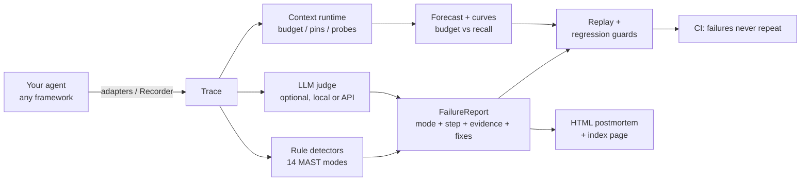

# approximately — Design & Launch Plan

> **Approximate memory, exact accountability.**
> A context runtime (budgeted windows + pins + recall probes) and a flight
> recorder (MAST failure attribution + replay + regression guards) sharing
> one recording infrastructure — together they form an agent reliability
> stack.

- Repository: `https://github.com/B1ueMu3ic4m/approximately`
- Version: 0.7.0
- Status: this document is the design and launch plan, published in-repo

---

## 1. Problem (why build this)

### 1.1 Academic grounding (first-hand results, 2025–2026)

| Finding | Source | Key numbers |
|---|---|---|
| Multi-agent failures classify into 14 modes / 3 categories | MAST, [arXiv:2503.13657](https://arxiv.org/abs/2503.13657) | Specification 41.77%, inter-agent misalignment 36.94%, verification 21.30% |
| **Automatic failure attribution is feasible today** | MAST (o1-as-judge) | F1 = 0.80 (few-shot) vs human agreement κ = 0.88 |
| Failures stem from **system organization**, not model capability | MAST interventions | +15.6% absolute success from one verification step; +9.4% from role prompts |
| The #1 single failure is "repeating completed steps" | MAST FM-1.3 | 17.14% of all traces |
| Failure-induced inefficiency inflates cost/latency by an order of magnitude | MAST | 10x+ |
| Context curation beats stuffing: 91.6% vs 71.0% success at 2.7x fewer tokens | [arXiv:2606.10209](https://arxiv.org/abs/2606.10209) | per-configuration evidence |
| GUI agents pass 85% of single tasks but only ~31% of long-horizon ones | OSWorld / OSWorld 2.0 | the benchmark-reality gap lives in error recovery |

Inference: the academic components (taxonomy, judge, benchmarks) shipped in
2025–2026, but production tooling only offers flat tracing
(Langfuse/LangSmith) — no attribution layer. That gap between paper and
product is exactly where approximately sits.

### 1.2 Product hypotheses

1. Teams running agents in production hit "it failed and I can't tell which
   step broke" daily (hourly pain frequency).
2. Developers star/pay for "automatic localization + reproducibility +
   prevention" when the demo lands in 30 seconds.
3. MAST as the classification kernel provides academic differentiation; a
   zero-dependency SDK provides engineering differentiation.

### 1.3 Naming

Everything about agents is approximate: context is compressed approximately,
memory is summarized approximately, traces are sampled approximately.
approximately makes those approximations safe — the context runtime
quantifies the approximation (effective-recall probes) and the flight
recorder delivers exact accountability when approximations break.
Tagline: **Approximate memory, exact accountability.**
Directions #1 (agent black box) and #2 (context runtime) from the original
research report are merged into this single product sharing one recorder.

---

## 2. Architecture

### 2.1 Modules

```
approximately/
├── trace.py       trace data model (Step / Trace), stdlib dataclasses + JSON
├── recorder.py    the flight recorder: Recorder + @agentstep decorator
├── store.py       local trace store (~/.approximately/traces/*.json)
├── taxonomy.py    the 14 MAST failure modes + evidence-backed fix library
├── detectors.py   rule-based detection engine (works with no LLM)
├── judge.py       optional LLM judge (OpenAI-compatible), strong/local presets
├── attributor.py  orchestration: rules ∪ judge → FailureReport
├── replayer.py    step-level replay with per-step diffs
├── regress.py     pytest regression-guard generation (incl. budget guards)
├── report.py      self-contained HTML postmortem (no JS, no CDN)
├── context.py     context runtime: budget, pins, compaction, recall probes,
│                  budget forecasting
├── cluster.py     cross-trace failure clustering (recidivist modes)
├── curve.py       budget→recall curves + success scatter (SVG/HTML)
├── distill.py     SFT export for local judge models + benchmark harness
├── demo.py        built-in deterministic failing agent (no API key)
├── cli.py         record / attribute / replay / test / report / context /
│                  cluster / curve / distill / benchmark / taxonomy
└── contrib/       framework adapters (lazy imports)
    ├── langgraph.py    LangChain/LangGraph callback handler
    ├── agents_sdk.py   OpenAI Agents SDK TracingProcessor
    └── crewai.py       CrewAI event-bus adapter (defensive)
```



### 2.3 Attribution pipeline

```
Trace ──► rule detectors (one per MAST mode → Detection{mode, step,
            evidence, confidence})
      ──► optional LLM judge (MAST taxonomy + trace JSON → verdict)
      ──► arbitration: rule+judge agreement boosts confidence; conflicts
          are recorded, never hidden
      ──► FailureReport: primary_mode / category / evidence chain /
          suggested fixes / replay_ready
```

Rule detectors now cover **all 14 MAST modes** (RepeatDetector FM-1.3,
NoTerminationDetector FM-1.5, ConversationResetDetector FM-2.1,
PrematureTerminationDetector FM-3.1, MissingVerificationDetector FM-3.2,
WeakVerificationDetector FM-3.3, ReasoningActionMismatchDetector FM-2.6,
DerailmentDetector FM-2.3, SpecViolationDetector FM-1.1,
RoleViolationDetector FM-1.2, ClarificationDetector FM-2.2,
WithholdingDetector FM-2.4, IgnoredInputDetector FM-2.5,
LostReferenceDetector FM-1.4). The fix library cites the MAST intervention
numbers (e.g. FM-3.2 → "add an explicit verification step, +15.6%").

### 2.4 Replay, regression guards, budget guards

- **Replay**: `Executor = Callable[[Step], str]`; replays every recorded
  step and diffs (text similarity / error / latency); verdicts:
  `reproduced` / `consistent` / `diverged`; supports A/B (original vs
  patched executor).
- **Regression guards**: generated pytest files embed the trace as base64
  (self-contained) and assert per failure mode — "no repeated (tool, args)",
  "every mutating call is verified", "runs never end silently on an error" —
  plus a replay-consistency guard for CI.
- **Budget guards (v0.3)**: `test --budget N --min-recall R` emits a guard
  that forecasts the recorded run through an N-token budget and fails when
  effective recall drops below R — making context-window changes behave like
  any other behavioral change in review.

### 2.5 Context runtime (v0.1 core, extended in v0.3)

- **Budgeted window**: context is a budget, not a dumping ground; eviction
  is oldest-first with class priority (tool_results → observations → plans
  → summaries → facts → task).
- **Pins**: task spec, constraints, and critical facts are never evicted —
  the mechanical prevention for MAST FM-1.4 (loss of conversation history).
- **Recall probe**: substring-presence checks over critical facts produce an
  effective-recall number after every policy decision.
- **Forecast**: replays a recorded trace through a budget (dry run) with
  eviction-driven incremental probing — O(evictions), not O(steps × facts).
- **Curves (v0.3)**: `budget_curve` sweeps budgets into a recall curve;
  `success_vs_tokens` scatters every store run colored by outcome;
  rendered as self-contained inline-SVG HTML.

### 2.6 Judge presets & distillation (v0.2)

- The full MAST prompt is ~5x too large for a 1–7B model to hold reliably.
  The `local` preset strips the taxonomy to ids + names.
- `distill` exports chat-format JSONL in exactly that shape, labeled by the
  rule detectors (free) or a teacher model (`--teacher`); fine-tune locally,
  point `APPROXIMATELY_JUDGE_MODEL` at it, use `preset="local"`.

### 2.7 Benchmark harness (v0.2)

`evaluate(labeled, predictor)` → per-mode precision/recall/F1, accuracy,
macro-F1. Dataset loaders: `approx` (native JSONL: trace dict + gold label)
and `mast` (heuristic adapter for MAST-Data-style records).

### 2.8 Zero-dependency principle

Core uses only the standard library (3.9+). `openai` is an optional extra;
framework adapters import lazily and degrade when the framework is absent.

---

## 3. Milestones

### v0.1.0 ✅ (delivered)
- [x] trace model + recorder + store
- [x] 14-mode MAST taxonomy + fix library
- [x] 6 rule detectors + arbitration
- [x] optional LLM judge (OpenAI-compatible)
- [x] replayer with A/B diffs
- [x] pytest regression generation
- [x] self-contained HTML report
- [x] CLI (30-second `approximately demo`)
- [x] deterministic no-API-key demo agent
- [x] comprehensive test suite: 104+ tests, 97% core coverage, 3-OS CI

### v0.2.0 ✅ (delivered)
- [x] adapters: LangChain/LangGraph callback handler, OpenAI Agents SDK
      TracingProcessor (tested against the real packages), CrewAI event-bus
      adapter (defensive)
- [x] judge presets (`strong`/`local`) + `distill` SFT exporter
      (rules or teacher labeling)
- [x] `benchmark` command: per-mode P/R/F1 + macro-F1; `approx`/`mast`
      dataset loaders

### v0.3 ✅ (delivered with 0.2.0)
- [x] `cluster`: cross-trace failure clustering, recidivist table
- [x] budget regression guards (`test --budget --min-recall`)
- [x] `curve`: budget→recall SVG report + success scatter

### v0.3.1 ✅ (delivered) — security hardening
- [x] **Tamper-evident evidence chains**: per-step sha256 chain stamped on
      every save; `verify` detects and localizes post-hoc edits
- [x] **HMAC-SHA256 keyed chains** (`APPROXIMATELY_SIGNING_KEY` /
      `--key-file`): cryptographic authenticity against adversarial
      forgery — the unkeyed chain's documented design gap, closed
- [x] Path-traversal blocks (store ids, scaffold names)
- [x] Threat model published (docs/SECURITY.md); parser hardened with a
      60+ payload fuzz contract

### v0.3.2 ✅ (delivered) — algorithm depth
- [x] **Bayesian evidence fusion**: detections scored as
      `log(prior_odds) + Σ log-likelihood-ratio(confidence)` with
      add-one-smoothed MAST base rates as priors; properties tested
      (accumulation, prior-vs-evidence calibration, signed bounded c=0)
- [x] **Budget optimizer**: recall is monotone in budget, so
      `approximately optimize` binary-searches the smallest budget keeping
      recall ≥ target (~10 probes on 20k-step traces)
- [x] Two O(n × evictions) quadratic scans eliminated in forecast
      (20k-step forecast 11.4s → 1.1s)

### v0.4.0 ✅ (delivered) — algorithms + integrations
- [x] **Trajectory alignment** (align.py): Needleman-Wunsch over
      normalized action sequences; identity/structure token two-tier
      scoring; `similar` similarity ranking
- [x] **Failure-precursor prediction** (precursor.py): structure-token
      n-grams (n=1..3), Laplace-smoothed conditionals, support-capped
      log-odds; `predict` early-warning command
- [x] **SARIF 2.1.0 export**: attribution as GitHub code-scanning alerts
      (`attribute --sarif`)
- [x] **MCP tool-poisoning scanner** (`scan-tool`): invisible chars, bidi
      attacks, homoglyph mixing, injection phrasing
- [x] **HMAC key rotation** (`rotate`)

### v0.5.0 ✅ (delivered) — statistical rigor
- [x] **Conformal attribution**: split-conformal prediction sets with a
      distribution-free coverage guarantee (alpha configurable); ambiguous
      runs widen the set honestly (tested superset property)
- [x] **Temperature calibration**: NLL-fitted (Guo et al. 2017 criterion —
      ECE deliberately rejected as a fitting objective: it collapses to a
      degenerate temperature on separable sets); ECE kept as reporting
- [x] `score_modes`: per-mode fusion score surface
- [x] `calibrate` command: held-out coverage + ECE report

### v0.5.0 additions ✅ — counterfactual root-cause analysis
- [x] do(step=∅) leave-one-out interventions over detected steps;
      root-cause / symptom / distributed-cause classification; causal
      ranking. Aliasing bug (Step objects shared with do-traces) caught
      by its own tests and fixed via deep copies.

### v0.5.0 additions ✅ — behavior-drift detection
- [x] PSI over action structure tokens between time windows;
      `approximately drift --baseline-ratio` with industry-convention
      thresholds; smoothing keeps disjoint distributions finite

### v0.6.0 ✅ (delivered) — structural trace diff
- [x] Needleman-Wunsch **traceback**: full edit script over two runs
      (equal/mutated/deleted/inserted per tool call)
- [x] `approximately diff <a> <b>`: failed-run vs last-success is the
      classic regression-debugging workflow
- [x] similarity consistent with align.py (tested within 0.01)

### v0.7.0 ✅ (delivered) — streaming monitor
- [x] Live failure-risk over in-flight runs: three signals (precursor,
      repetition velocity, verification debt) fused with hysteresis
- [x] Escalation fires once per level crossing; O(window) per observation

### v0.7.0 additions ✅ — concurrent store
- [x] Atomic saves (temp + os.replace) and per-id lock files with
      stale-lock recovery; concurrent same-id writers tested

### v0.8.0 ✅ (delivered) — AutoGen adapter + trend verdict
- [x] AutoGen v0.4+ adapter: event-log handler (`autogen_core.events`
      via standard logging, the seam AutoGen Studio consumes) plus a
      transparent `RecordingChatCompletionClient` proxy at the model
      boundary; version-tolerant, exception-guarded, faked in tests
- [x] Failure-rate trend in `report --all`: inline-SVG sparkline +
      Theil–Sen slope (outlier-resistant) with a verdict judged relative
      to the series' own mean level
- [x] Complexity audit: every C-rank block (14, under `--max-absolute B`,
      stricter than CI) refactored to B/A; full suite green throughout
- [x] Security fuzzing of new surfaces; fixed `cluster.trend` overflow
      on out-of-range timestamps and sparkline `nan` coordinate leak

### v0.9.0 ✅ (delivered) — LlamaIndex + key provenance
- [x] LlamaIndex adapter: duck-typed callback handler (BaseCallbackHandler
      protocol without importing llama_index); LLM / FUNCTION_CALL /
      AGENT_STEP / RETRIEVE / EXCEPTION mapped; enum-or-string event
      types, hostile payloads fuzzed
- [x] HMAC key-ID + rotation counter: keyed blocks carry a key
      fingerprint and rotation count; new `wrong-key` verdict replaces
      the false TAMPERED on key mismatch; forgery still never verifies
- [x] Adapters now: LangChain/LangGraph, OpenAI Agents SDK, CrewAI,
      AutoGen v0.4+, LlamaIndex

### v0.10.0 ✅ (delivered) — Dispatcher seam + leaderboard + recipes
- [x] LlamaIndex Dispatcher span handler: structured spans (LLM,
      retrieval, tool call, agent run) mapped to recorder steps;
      dropped spans carry the exception into attribution
- [x] `benchmark --html`: self-contained leaderboard page, F1-sorted
      per-mode table, escaping + clamping hardened, unknown mode ids
      fall back to OTHER
- [x] docs/DISTILLATION.md: per-serving-stack recipes (Ollama,
      llama.cpp, vLLM LoRA, TGI, OpenAI fine-tunes) + honest
      per-mode expectations

### v0.11.0 ✅ (delivered) — evidence ledger + fleet merge
- [x] Self-chained append-only ledger of integrity roots (opt-in);
      `verify` flags rolled-back-but-validly-signed traces and a broken
      ledger, with distinct exit codes
- [x] `approximately merge`: fleet imports that refuse TAMPERED /
      wrong-key evidence; skip/replace/rename conflict policies

### v0.12.0 ✅ (delivered) — fleet dashboard + latency anomalies
- [x] `fleet`: N-store survey, fleet KPIs, per-store sparklines and
      top modes, ledger-state badges; rule-detector-only attribution
- [x] `anomalies`: MAD modified z-score (3.5 threshold), slow+fast
      outliers, degenerate cases honest; report card + CLI exit code
- [x] Fixed: before-position `--store` was clobbered by the subparser
      default (classic argparse bug); both positions work now

### v0.13.0 ✅ (delivered) — trend alerts + real-data benchmark
- [x] Fleet trend verdicts wired to CI (`--fail-on-worsening`)
- [x] MAST-Data converter with honest exclusion accounting; first
      real-data run (463 files -> 13 single-label records -> 0.00)
      published with structural analysis in docs/LEADERBOARD.md

### v0.14.0 ✅ (delivered) — prose family + benchmark v2
- [x] Five prose detectors with exclusive family gating; a-priori
      thresholds (never fitted on the benchmark)
- [x] MAST-Data v2: HyperAgent log parser, harness filtering, signal
      floor, annotated-failure semantics; real run published with
      per-mode structural diagnosis (0.00, honestly explained)
- [x] re-sign counter in integrity blocks

### v0.15.0 ✅ (delivered) — shingle restart + FM-2.6
- [x] Order-tolerant restart via trigram Jaccard (0.5) beside the
      verbatim path (0.9); confidence coordinated with the labeler
      floor after the 0.6-below-0.7 calibration lesson
- [x] ProseThoughtActionDetector for FM-2.6 entity divergence
- [x] Benchmark v4: first real TP - accuracy 0.08, FM-2.1 F1 0.50

### v0.16.0 ✅ (delivered) — fleet webhooks
- [x] Signed JSON fleet alerts (--webhook + HMAC signature header)
- [x] FM-3.2 outcome-level analysis scoped and deferred: all 6 golds
      contain verification AND execution language; the annotation
      judges whether the *outcome* was verified - regex cannot cross
      that semantic gap on n=6 without gold-fitting (documented)

### next
- harness-echo discrimination for FM-1.3 precision
- FM-3.2 outcome-level verification (needs richer features than regex)
- fleet trend digest scheduling

---

## 4. Launch plan

1. **Artifacts**: public GitHub repo + PyPI + technical blog post
   (MAST-data visualization, demo GIF).
2. **Channels in order**: ① Hacker News "Show HN: Approximately – a dashcam
   and automatic postmortems for AI agents"; ② r/LocalLLaMA +
   r/LLMDevs (local-model judge angle); ③ X/Twitter agent community;
   ④ Chinese dev communities (Jike/Zhihu).
3. **Above-the-fold promise**: `pip install approximately && approximately
   demo` → a full attribution report in 30 seconds.
4. **Virality hook**: every HTML report footer carries the repo link.
5. **Metrics**: 500 stars / 2k PyPI downloads in month one = healthy;
   the core conversion is demo → own-agent instrumentation, so the
   Recorder API must stay ≤ 5 lines.

## 5. Risks & mitigations

| Risk | Mitigation |
|---|---|
| Langfuse/LangSmith build attribution downstream | they are SaaS-tracing-first; we are local, zero-dependency, MAST-semantic; open-source speed is the moat |
| Rule-detector false positives | every Detection carries readable evidence; rule vs judge sources are labeled separately; confidence thresholds configurable |
| Benchmark dataset licensing/reproduction | cite the taxonomy with attribution; no redistribution of MAST-Data — provide loaders, not data |
| Single-maintainer bandwidth | zero-dependency core with three small interfaces (Recorder/Attributor/Replayer) keeps the maintenance surface deliberately tiny |

## 6. References

Cemri et al., *Why Do Multi-Agent LLM Systems Fail?* (MAST), arXiv:2503.13657, 2025.
Bohnet et al., *Why Do LLM Agents Fail and How Can They Learn From Failures?*, arXiv:2509.25370, 2025.
*Who&When: Automated Failure Attribution in Multi-Agent Systems*, arXiv:2505.00212, 2025.
Xie et al., *OSWorld: Benchmarking Multimodal Agents*, arXiv:2404.07972, 2024.
*Efficient Context Engineering for Long-Horizon Tool-Using Agents*, arXiv:2606.10209, 2026.
Anthropic, *Effective Context Engineering for AI Agents*, 2025.
