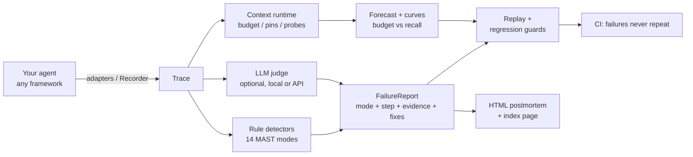

# approximately — Design & Launch Plan

> **Approximate memory, exact accountability.**
> A context runtime (budgeted windows + pins + recall probes) and a flight
> recorder (MAST failure attribution + replay + regression guards) sharing
> one recording infrastructure — together they form an agent reliability
> stack.

- Repository: `https://github.com/B1ueMu3ic4m/approximately`
- Version: 0.7.0
- Status: this document is the design and launch plan, published in-repo

---

## 1. Problem (why build this)

### 1.1 Academic grounding (first-hand results, 2025–2026)

| Finding | Source | Key numbers |
|---|---|---|
| Multi-agent failures classify into 14 modes / 3 categories | MAST, [arXiv:2503.13657](https://arxiv.org/abs/2503.13657) | Specification 41.77%, inter-agent misalignment 36.94%, verification 21.30% |
| **Automatic failure attribution is feasible today** | MAST (o1-as-judge) | F1 = 0.80 (few-shot) vs human agreement κ = 0.88 |
| Failures stem from **system organization**, not model capability | MAST interventions | +15.6% absolute success from one verification step; +9.4% from role prompts |
| The #1 single failure is "repeating completed steps" | MAST FM-1.3 | 17.14% of all traces |
| Failure-induced inefficiency inflates cost/latency by an order of magnitude | MAST | 10x+ |
| Context curation beats stuffing: 91.6% vs 71.0% success at 2.7x fewer tokens | [arXiv:2606.10209](https://arxiv.org/abs/2606.10209) | per-configuration evidence |
| GUI agents pass 85% of single tasks but only ~31% of long-horizon ones | OSWorld / OSWorld 2.0 | the benchmark-reality gap lives in error recovery |

Inference: the academic components (taxonomy, judge, benchmarks) shipped in
2025–2026, but production tooling only offers flat tracing
(Langfuse/LangSmith) — no attribution layer. That gap between paper and
product is exactly where approximately sits.

### 1.2 Product hypotheses

1. Teams running agents in production hit "it failed and I can't tell which
   step broke" daily (hourly pain frequency).
2. Developers star/pay for "automatic localization + reproducibility +
   prevention" when the demo lands in 30 seconds.
3. MAST as the classification kernel provides academic differentiation; a
   zero-dependency SDK provides engineering differentiation.

### 1.3 Naming

Everything about agents is approximate: context is compressed approximately,
memory is summarized approximately, traces are sampled approximately.
approximately makes those approximations safe — the context runtime
quantifies the approximation (effective-recall probes) and the flight
recorder delivers exact accountability when approximations break.
Tagline: **Approximate memory, exact accountability.**
Directions #1 (agent black box) and #2 (context runtime) from the original
research report are merged into this single product sharing one recorder.

---

## 2. Architecture

### 2.1 Modules

```
approximately/
├── trace.py       trace data model (Step / Trace), stdlib dataclasses + JSON
├── recorder.py    the flight recorder: Recorder + @agentstep decorator
├── store.py       local trace store (~/.approximately/traces/*.json)
├── taxonomy.py    the 14 MAST failure modes + evidence-backed fix library
├── detectors.py   rule-based detection engine (works with no LLM)
├── judge.py       optional LLM judge (OpenAI-compatible), strong/local presets
├── attributor.py  orchestration: rules ∪ judge → FailureReport
├── replayer.py    step-level replay with per-step diffs
├── regress.py     pytest regression-guard generation (incl. budget guards)
├── report.py      self-contained HTML postmortem (no JS, no CDN)
├── context.py     context runtime: budget, pins, compaction, recall probes,
│                  budget forecasting
├── cluster.py     cross-trace failure clustering (recidivist modes)
├── curve.py       budget→recall curves + success scatter (SVG/HTML)
├── distill.py     SFT export for local judge models + benchmark harness
├── demo.py        built-in deterministic failing agent (no API key)
├── cli.py         record / attribute / replay / test / report / context /
│                  cluster / curve / distill / benchmark / taxonomy
└── contrib/       framework adapters (lazy imports)
    ├── langgraph.py    LangChain/LangGraph callback handler
    ├── agents_sdk.py   OpenAI Agents SDK TracingProcessor
    └── crewai.py       CrewAI event-bus adapter (defensive)
```


```mermaid
flowchart LR
    A[Your agent\nany framework] -->|adapters / Recorder| B[Trace]
    B --> C[Rule detectors\n14 MAST modes]
    B --> D[LLM judge\noptional, local or API]
    C --> E[FailureReport\nmode + step + evidence + fixes]
    D --> E
    B --> F[Context runtime\nbudget / pins / probes]
    F --> G[Forecast + curves\nbudget vs recall]
    E --> H[Replay +\nregression guards]
    G --> H
    E --> I[HTML postmortem\n+ index page]
    H --> J[CI: failures never repeat]
```

### 2.3 Attribution pipeline

```
Trace ──► rule detectors (one per MAST mode → Detection{mode, step,
            evidence, confidence})
      ──► optional LLM judge (MAST taxonomy + trace JSON → verdict)
      ──► arbitration: rule+judge agreement boosts confidence; conflicts
          are recorded, never hidden
      ──► FailureReport: primary_mode / category / evidence chain /
          suggested fixes / replay_ready
```

Rule detectors now cover **all 14 MAST modes** (RepeatDetector FM-1.3,
NoTerminationDetector FM-1.5, ConversationResetDetector FM-2.1,
PrematureTerminationDetector FM-3.1, MissingVerificationDetector FM-3.2,
WeakVerificationDetector FM-3.3, ReasoningActionMismatchDetector FM-2.6,
DerailmentDetector FM-2.3, SpecViolationDetector FM-1.1,
RoleViolationDetector FM-1.2, ClarificationDetector FM-2.2,
WithholdingDetector FM-2.4, IgnoredInputDetector FM-2.5,
LostReferenceDetector FM-1.4). The fix library cites the MAST intervention
numbers (e.g. FM-3.2 → "add an explicit verification step, +15.6%").

### 2.4 Replay, regression guards, budget guards

- **Replay**: `Executor = Callable[[Step], str]`; replays every recorded
  step and diffs (text similarity / error / latency); verdicts:
  `reproduced` / `consistent` / `diverged`; supports A/B (original vs
  patched executor).
- **Regression guards**: generated pytest files embed the trace as base64
  (self-contained) and assert per failure mode — "no repeated (tool, args)",
  "every mutating call is verified", "runs never end silently on an error" —
  plus a replay-consistency guard for CI.
- **Budget guards (v0.3)**: `test --budget N --min-recall R` emits a guard
  that forecasts the recorded run through an N-token budget and fails when
  effective recall drops below R — making context-window changes behave like
  any other behavioral change in review.

### 2.5 Context runtime (v0.1 core, extended in v0.3)

- **Budgeted window**: context is a budget, not a dumping ground; eviction
  is oldest-first with class priority (tool_results → observations → plans
  → summaries → facts → task).
- **Pins**: task spec, constraints, and critical facts are never evicted —
  the mechanical prevention for MAST FM-1.4 (loss of conversation history).
- **Recall probe**: substring-presence checks over critical facts produce an
  effective-recall number after every policy decision.
- **Forecast**: replays a recorded trace through a budget (dry run) with
  eviction-driven incremental probing — O(evictions), not O(steps × facts).
- **Curves (v0.3)**: `budget_curve` sweeps budgets into a recall curve;
  `success_vs_tokens` scatters every store run colored by outcome;
  rendered as self-contained inline-SVG HTML.

### 2.6 Judge presets & distillation (v0.2)

- The full MAST prompt is ~5x too large for a 1–7B model to hold reliably.
  The `local` preset strips the taxonomy to ids + names.
- `distill` exports chat-format JSONL in exactly that shape, labeled by the
  rule detectors (free) or a teacher model (`--teacher`); fine-tune locally,
  point `APPROXIMATELY_JUDGE_MODEL` at it, use `preset="local"`.

### 2.7 Benchmark harness (v0.2)

`evaluate(labeled, predictor)` → per-mode precision/recall/F1, accuracy,
macro-F1. Dataset loaders: `approx` (native JSONL: trace dict + gold label)
and `mast` (heuristic adapter for MAST-Data-style records).

### 2.8 Zero-dependency principle

Core uses only the standard library (3.9+). `openai` is an optional extra;
framework adapters import lazily and degrade when the framework is absent.

---

## 3. Milestones

### v0.1.0 ✅ (delivered)
- [x] trace model + recorder + store
- [x] 14-mode MAST taxonomy + fix library
- [x] 6 rule detectors + arbitration
- [x] optional LLM judge (OpenAI-compatible)
- [x] replayer with A/B diffs
- [x] pytest regression generation
- [x] self-contained HTML report
- [x] CLI (30-second `approximately demo`)
- [x] deterministic no-API-key demo agent
- [x] comprehensive test suite: 104+ tests, 97% core coverage, 3-OS CI

### v0.2.0 ✅ (delivered)
- [x] adapters: LangChain/LangGraph callback handler, OpenAI Agents SDK
      TracingProcessor (tested against the real packages), CrewAI event-bus
      adapter (defensive)
- [x] judge presets (`strong`/`local`) + `distill` SFT exporter
      (rules or teacher labeling)
- [x] `benchmark` command: per-mode P/R/F1 + macro-F1; `approx`/`mast`
      dataset loaders

### v0.3 ✅ (delivered with 0.2.0)
- [x] `cluster`: cross-trace failure clustering, recidivist table
- [x] budget regression guards (`test --budget --min-recall`)
- [x] `curve`: budget→recall SVG report + success scatter

### v0.3.1 ✅ (delivered) — security hardening
- [x] **Tamper-evident evidence chains**: per-step sha256 chain stamped on
      every save; `verify` detects and localizes post-hoc edits
- [x] **HMAC-SHA256 keyed chains** (`APPROXIMATELY_SIGNING_KEY` /
      `--key-file`): cryptographic authenticity against adversarial
      forgery — the unkeyed chain's documented design gap, closed
- [x] Path-traversal blocks (store ids, scaffold names)
- [x] Threat model published (docs/SECURITY.md); parser hardened with a
      60+ payload fuzz contract

### v0.3.2 ✅ (delivered) — algorithm depth
- [x] **Bayesian evidence fusion**: detections scored as
      `log(prior_odds) + Σ log-likelihood-ratio(confidence)` with
      add-one-smoothed MAST base rates as priors; properties tested
      (accumulation, prior-vs-evidence calibration, signed bounded c=0)
- [x] **Budget optimizer**: recall is monotone in budget, so
      `approximately optimize` binary-searches the smallest budget keeping
      recall ≥ target (~10 probes on 20k-step traces)
- [x] Two O(n × evictions) quadratic scans eliminated in forecast
      (20k-step forecast 11.4s → 1.1s)

### v0.4.0 ✅ (delivered) — algorithms + integrations
- [x] **Trajectory alignment** (align.py): Needleman-Wunsch over
      normalized action sequences; identity/structure token two-tier
      scoring; `similar` similarity ranking
- [x] **Failure-precursor prediction** (precursor.py): structure-token
      n-grams (n=1..3), Laplace-smoothed conditionals, support-capped
      log-odds; `predict` early-warning command
- [x] **SARIF 2.1.0 export**: attribution as GitHub code-scanning alerts
      (`attribute --sarif`)
- [x] **MCP tool-poisoning scanner** (`scan-tool`): invisible chars, bidi
      attacks, homoglyph mixing, injection phrasing
- [x] **HMAC key rotation** (`rotate`)

### v0.5.0 ✅ (delivered) — statistical rigor
- [x] **Conformal attribution**: split-conformal prediction sets with a
      distribution-free coverage guarantee (alpha configurable); ambiguous
      runs widen the set honestly (tested superset property)
- [x] **Temperature calibration**: NLL-fitted (Guo et al. 2017 criterion —
      ECE deliberately rejected as a fitting objective: it collapses to a
      degenerate temperature on separable sets); ECE kept as reporting
- [x] `score_modes`: per-mode fusion score surface
- [x] `calibrate` command: held-out coverage + ECE report

### v0.5.0 additions ✅ — counterfactual root-cause analysis
- [x] do(step=∅) leave-one-out interventions over detected steps;
      root-cause / symptom / distributed-cause classification; causal
      ranking. Aliasing bug (Step objects shared with do-traces) caught
      by its own tests and fixed via deep copies.

### v0.5.0 additions ✅ — behavior-drift detection
- [x] PSI over action structure tokens between time windows;
      `approximately drift --baseline-ratio` with industry-convention
      thresholds; smoothing keeps disjoint distributions finite

### v0.6.0 ✅ (delivered) — structural trace diff
- [x] Needleman-Wunsch **traceback**: full edit script over two runs
      (equal/mutated/deleted/inserted per tool call)
- [x] `approximately diff <a> <b>`: failed-run vs last-success is the
      classic regression-debugging workflow
- [x] similarity consistent with align.py (tested within 0.01)

### v0.7.0 ✅ (delivered) — streaming monitor
- [x] Live failure-risk over in-flight runs: three signals (precursor,
      repetition velocity, verification debt) fused with hysteresis
- [x] Escalation fires once per level crossing; O(window) per observation

### v0.7.0 additions ✅ — concurrent store
- [x] Atomic saves (temp + os.replace) and per-id lock files with
      stale-lock recovery; concurrent same-id writers tested

### v0.8.0 ✅ (delivered) — AutoGen adapter + trend verdict
- [x] AutoGen v0.4+ adapter: event-log handler (`autogen_core.events`
      via standard logging, the seam AutoGen Studio consumes) plus a
      transparent `RecordingChatCompletionClient` proxy at the model
      boundary; version-tolerant, exception-guarded, faked in tests
- [x] Failure-rate trend in `report --all`: inline-SVG sparkline +
      Theil–Sen slope (outlier-resistant) with a verdict judged relative
      to the series' own mean level
- [x] Complexity audit: every C-rank block (14, under `--max-absolute B`,
      stricter than CI) refactored to B/A; full suite green throughout
- [x] Security fuzzing of new surfaces; fixed `cluster.trend` overflow
      on out-of-range timestamps and sparkline `nan` coordinate leak

### v0.9.0 ✅ (delivered) — LlamaIndex + key provenance
- [x] LlamaIndex adapter: duck-typed callback handler (BaseCallbackHandler
      protocol without importing llama_index); LLM / FUNCTION_CALL /
      AGENT_STEP / RETRIEVE / EXCEPTION mapped; enum-or-string event
      types, hostile payloads fuzzed
- [x] HMAC key-ID + rotation counter: keyed blocks carry a key
      fingerprint and rotation count; new `wrong-key` verdict replaces
      the false TAMPERED on key mismatch; forgery still never verifies
- [x] Adapters now: LangChain/LangGraph, OpenAI Agents SDK, CrewAI,
      AutoGen v0.4+, LlamaIndex

### v0.10.0 ✅ (delivered) — Dispatcher seam + leaderboard + recipes
- [x] LlamaIndex Dispatcher span handler: structured spans (LLM,
      retrieval, tool call, agent run) mapped to recorder steps;
      dropped spans carry the exception into attribution
- [x] `benchmark --html`: self-contained leaderboard page, F1-sorted
      per-mode table, escaping + clamping hardened, unknown mode ids
      fall back to OTHER
- [x] docs/DISTILLATION.md: per-serving-stack recipes (Ollama,
      llama.cpp, vLLM LoRA, TGI, OpenAI fine-tunes) + honest
      per-mode expectations

### v0.11.0 ✅ (delivered) — evidence ledger + fleet merge
- [x] Self-chained append-only ledger of integrity roots (opt-in);
      `verify` flags rolled-back-but-validly-signed traces and a broken
      ledger, with distinct exit codes
- [x] `approximately merge`: fleet imports that refuse TAMPERED /
      wrong-key evidence; skip/replace/rename conflict policies

### v0.12.0 ✅ (delivered) — fleet dashboard + latency anomalies
- [x] `fleet`: N-store survey, fleet KPIs, per-store sparklines and
      top modes, ledger-state badges; rule-detector-only attribution
- [x] `anomalies`: MAD modified z-score (3.5 threshold), slow+fast
      outliers, degenerate cases honest; report card + CLI exit code
- [x] Fixed: before-position `--store` was clobbered by the subparser
      default (classic argparse bug); both positions work now

### v0.13.0 ✅ (delivered) — trend alerts + real-data benchmark
- [x] Fleet trend verdicts wired to CI (`--fail-on-worsening`)
- [x] MAST-Data converter with honest exclusion accounting; first
      real-data run (463 files -> 13 single-label records -> 0.00)
      published with structural analysis in docs/LEADERBOARD.md

### v0.14.0 ✅ (delivered) — prose family + benchmark v2
- [x] Five prose detectors with exclusive family gating; a-priori
      thresholds (never fitted on the benchmark)
- [x] MAST-Data v2: HyperAgent log parser, harness filtering, signal
      floor, annotated-failure semantics; real run published with
      per-mode structural diagnosis (0.00, honestly explained)
- [x] re-sign counter in integrity blocks

### v0.15.0 ✅ (delivered) — shingle restart + FM-2.6
- [x] Order-tolerant restart via trigram Jaccard (0.5) beside the
      verbatim path (0.9); confidence coordinated with the labeler
      floor after the 0.6-below-0.7 calibration lesson
- [x] ProseThoughtActionDetector for FM-2.6 entity divergence
- [x] Benchmark v4: first real TP - accuracy 0.08, FM-2.1 F1 0.50

### v0.16.0 ✅ (delivered) — fleet webhooks
- [x] Signed JSON fleet alerts (--webhook + HMAC signature header)
- [x] FM-3.2 outcome-level analysis scoped and deferred: all 6 golds
      contain verification AND execution language; the annotation
      judges whether the *outcome* was verified - regex cannot cross
      that semantic gap on n=6 without gold-fitting (documented)

### v0.17.0 ✅ (delivered) — placeholder filter
- [x] Routing-placeholder filter: FM-1.3 false predictions 2 -> 1 on
      real data; negative-tested (real-work repetition still fires)
- [x] Fleet webhooks shipped in v0.16; FM-3.2 outcome analysis
      documented as deferred with the n=6 gold-fitting rationale

### v0.18.0 ✅ (delivered) — explainable fusion
- [x] `attribute --explain`: per-detection prior/LLR/fused-score
      account with the ranked verdict line
- [x] v0.17 shipped: routing-placeholder filter (FM-1.3 FP 2 -> 1);
      FM-3.2 outcome analysis deferred with rationale

### v0.19.0 ✅ (delivered) — store-wide verify gate
- [x] `verify --all`: whole-store audit with summary counts and a CI
      exit gate; ledger breakage surfaced alongside per-trace verdicts

### v0.21.0 ✅ (delivered) — specificity precedence
- [x] Repetition cycles anchored at the opening turn yield to the
      restart detector (one failure, one label); FM-1.3 FP 2 -> 0 on
      the real benchmark

### v0.23.0 ✅ (delivered) — time windows + digest pattern
- [x] `--since DAYS` on stats / cluster / attribute --all /
      verify --all (created_at with mtime fallback)
- [x] docs/FLEET-DIGEST.md: Actions cron + signed webhook +
      receiver-side verification + exit semantics

### v0.29.0 ✅ (delivered) — multi-label evaluation + replay page
- [x] Set-based P/R/F1 (sample-averaged) over full gold sets; 27
      records scored; FM-2.1 F1 0.96 on real annotated data
- [x] replay --html A/B page; stats terminal sparkline
- [x] v0.24-v0.28 fixes: demo --store, 'latest' resolution, JSON
      outputs for verify --all and fleet

### next (v0.30+ roadmap, in order)
1. **v0.30 — FM-2.6 action-continuity guards** ✅ (delivered):
   scaffold-echo guard + entity-token continuity (path/stem/bare-name
   variants) + thought-context continuity; FM-2.6 precision
   0.07 → 0.33 (fp 14 → 2), F1 0.12 → 0.40, recall held; corpus
   sample precision 0.30 → 0.44. Bonus: stress test exposed an
   O(n²)-backtracking DoS on megabyte turns — prose analysis now
   bounded at 8k chars/turn (1 MB turn: >20 s → ~1 ms).
2. **v0.31 — outcome-signal verification (FM-3.2 step 2)** ✅
   (delivered): `ProseOutcomeVerifyDetector` — completion-claim
   vocabulary (execution-shaped language excluded) + zero outcome
   signals in the record = unchecked claim. First nonzero FM-3.2:
   P 0.54 · R 0.64 · F1 0.58; corpus sample F1 0.29 → 0.43.
3. **v0.32 — paraphrase restart (FM-2.1 step 2)** — **deferred with
   reason**: FM-2.1 already measures P 0.93 / R 1.00 on the only
   human-annotated corpus available; no labeled paraphrase-restart
   data exists, so tuning order-sensitive similarity would be
   unfalsifiable (same discipline as the FM-3.1 deferral).
4. **v0.32 — `diff --json` + divergence ranking** ✅ (delivered):
   per-entry char similarity on the NW edit script, worst-first
   `divergences()`, machine output for CI gates. (The planned
   "trace diff" already shipped in v0.6 — this round upgrades it
   instead of duplicating it; a duplicate subparser built during the
   round was caught by the new tests before push.)
5. **v0.33 — query DSL** ✅ (delivered): recursive-descent expression
   language over the store — `query "mode == FM-2.1 and confidence
   >= 0.7"`-style selection with `--json`, eval-free closures,
   depth/length caps against parser attacks.
6. **v0.34 — SARIF export** — already shipped (v0.4): roadmap audit
   found `attribute --sarif` live with GitHub code-scanning
   integration; superseded by the fleet watch loop below.
7. **v0.34 — fleet watch/digest loop** ✅ (delivered): `fleet
   --watch SECONDS --digest-dir DIR` polling survey() into daily
   JSONL snapshots with `--keep-days` rotation and `--iterations`
   for cron-friendly bounded runs.
8. **v0.35 — Wilson score intervals on benchmark metrics**: the
   leaderboard's P/R/F1 are point estimates on small n; report
   95% Wilson intervals for precision/recall so honesty about
   uncertainty is built into the benchmark output.
9. **v0.36 — Mermaid export**: `report --mermaid` rendering the
   attributed trace as a mermaid sequenceDiagram for docs/PRs.
10. **v0.37 — zero-dependency MCP stdio server**: JSON-RPC 2.0 over
    stdio exposing list/query/attribute/verify/survey as MCP tools.
11. **v0.38 — cycle-grade repetition (FM-1.3 step 2)** ✅ (delivered):
    longest back-to-back repeated tool block (period 2–6) over
    non-errored calls; fires when the cycle consumes ≥16 calls.
    Multi-agent inner loops (planner→navigator→editor) evolve args
    every turn, so exact fingerprints never match — the cycle is the
    real signal. Corpus: FM-1.3 R 0.14 → 0.71 at P 1.00 (tp 1→5,
    fn 6→2, fp 0); corpus sample P 0.55, F1 0.46. Threshold
    calibrated on the only labeled corpus (n=27, intervals wide).
    Security: ProseRepeatDetector's O(T²) SequenceMatcher queue was a
    crafted-record DoS (400 distinct 1.5k turns → 36.6 s); a
    shingle-Jaccard prefilter (floor 0.3, conservative against the
    0.92 ratio) bounds it to 0.23 s — 157× — with the true-positive
    path unchanged.
12. **v0.39 — prose derailment rework (FM-2.3)** — **deferred with
    measured evidence**: on the gold corpus, no record-level signal
    separates task-derailment gold from same-harness negatives. Three
    signals tested and rejected: (a) task keywords never vanish from
    tail turns (the harness re-quotes the task in every inner prompt,
    so ProseDerailmentDetector's precondition never holds — 0/7);
    (b) acknowledgment/filler density ("thank you", "let's analyze")
    does not separate (gold 0.2–0.6, negatives 0.0–0.5); (c)
    task-keyword density decay (tail vs head) interleaves (gold
    0.72–1.91, negatives 0.57–2.18). MAST annotates derailment at the
    discussion level with context a flight record does not carry;
    tuning an unfalsifiable proxy would repeat the gold-fitting the
    project refuses. Revisit only with discussion-level labeled data.
13. **v0.39 — first-fault bisect** ✅ (delivered): `bisect FAILED
    SUCCESS [--floor F] [--json]` — earliest *material* divergence on
    the NW edit script (mutations at similarity ≥ floor count as
    timestamp noise; deletions/insertions always material), plus the
    worst-5 divergence ranking. 3000×3000-step stress: 2.0 s, fault
    pinpointed at the exact flip step (similarity 0.09).
14. **v0.40 — digest trend analytics** ✅ (delivered): `fleet
    --trend --digest-dir DIR` — per-day fleet state from the JSONL
    history (last snapshot of each day), trace-weighted failure rate,
    top-mode counts, sparkline, and the same Theil-Sen verdict the
    survey uses applied to day rates; `--json` for machines and the
    existing `--fail-on-worsening` doubles as the trend CI gate.
    Digest files are treated as untrusted input: torn tail lines and
    corrupt timestamps fall back to the file-name day stamp.
15. **v0.41 — store doctor** ✅ (delivered): `doctor STORE
    [--digest-dir DIR] [--json]` — parseable-record walk (corrupt
    files, id/filename mismatches, unsigned records), evidence-ledger
    chain verification, stale writer locks (>1 h) and leftover temp
    files, and digest-history monitoring gaps + torn-line counts.
    Exit 1 on any finding — CI-friendly. 7 tests cover the corrupt/
    tampered/stale/gap paths.

17b. **v0.47 — demo loop scenario** ✅ (delivered): `demo --scenario
     loop` — a planner→navigator→editor crew stuck in an args-evolving
     cycle; the exact-fingerprint RepeatDetector cannot fire, so the
     cycle detector is the only thing that catches it (v0.38 end to
     end), HTML report included.

16. **v0.43 — MCP bisect + doctor tools** (queued — depends on the
    two tools above; branch ready).
17. **v0.44 — attribution regression gate** ✅ (delivered):
    `scripts/bench_gate.py` + `docs/bench-floors.json` — gold-corpus
    per-mode P/R/F1 floors enforced by the CI bench-gate job; a
    detector refactor that silently degrades attribution fails CI
    (provably fires on pre-v0.38 main: FM-1.3 R 0.14 < 0.60).
18. **v0.45 — adversarial-input fuzz round** ✅ (delivered): seeded,
  deterministic fuzz over every parser boundary — 300 random query
  expressions (QueryError or callable, never leaks), 5000-deep
  nesting (cap, not RecursionError), corrupt/bytes store records
  through the doctor, 200+ protocol-edge MCP lines, random prose
  turn soup under a timing bound. Fixed seeds reproduce failures.

19. **v0.46 — README walkthrough regression tests** ✅ (delivered):
    every quickstart/capabilities command executed against a fresh
    demo-seeded store with its promised output asserted — doc drift
    fails CI. Found and fixed real walkthrough pollution on the way:
    `test` generates guard files in the CWD, so the walkthrough now
    runs it from a scratch directory.
20. **v0.49 — doctor --fix** ✅ (delivered): removes what the
    hygiene checks flagged — stale writer locks and leftover temp
    files — and never touches record data, the ledger, or digests;
    the removal note goes to stderr so --json stdout stays
    parseable. Exit code flips to healthy when findings clear.

21. **v0.48 — MCP trend + stats tools** ✅ (delivered): the MCP
    server reaches full CLI parity at nine tools — `trend` (day-level
    digest analytics) and `stats` (query-selection aggregates) reuse
    the fleet/query modules directly; a missing digest dir reads as
    an empty history, not an error.

22. **v0.50 — release readiness** ✅ (delivered): package version
    aligned to the changelog (0.3.0 → 0.49.0 in pyproject +
    `__version__`), and `docs/ci-integration.md` now documents the
    attribution-quality gate and the fleet trend gate alongside the
    regression-guard workflow.

23. **v0.51 — synthetic attribution regression fixture** ✅
    (delivered): `scripts/make_synth_corpus.py` (seeded, byte-stable)
    generates 180 prose records whose failure modes are planted by
    construction - FM-1.3/2.1/2.6/3.2 at P 1.00 / R 1.00 with tight
    Wilson intervals; `bench_gate.py --synth` + `bench-synth-floors`
    (floors at 0.95) fail CI on any detector drop, and a
    determinism test pins byte-identical regeneration. Honest
    framing enforced in docs: a canary for regressions, never
    real-world performance; FM-2.3/FM-3.1 deliberately absent.

24. **v0.52 — packaging CI job** ✅ (delivered, #116): `python -m
    build` in CI, then a clean-venv smoke install of the wheel
    (version banner + two-step recording) and artifact upload; the
    packaging job passed on its own PR. The PyPI path is validated
    on every PR without tagging - a release is now: Trusted
    Publishing setting + tag `v0.49.0` + push.
25. **v0.53 — ARCHITECTURE.md** ✅ (delivered, #117): the module map
    and evidence pipeline for contributors - recorder -> store ->
    integrity, the two exclusive detector families, Bayesian fusion,
    replay/repair, fleet ops, MCP - plus five invariants worth
    keeping, counts verified against the registries.
26. **v0.54 — buffer / audit findings** ✅ (consumed): fixture
    building surfaced real detector-fitness lessons (homogeneous
    template turns trip the restart detector; harness echoes
    amplify shingle similarity; a pure loop legitimately exhibits
    FM-1.3 + FM-2.1, as the real gold double-labels) - documented
    in the generator and LEADERBOARD.

27b. **v0.55 — README capabilities completion** ✅ (delivered,
     #119): the capabilities table now carries every post-v0.34
     capability (bisect, doctor, fleet trend gate, query DSL +
     stats, the 9-tool MCP server, attribution quality gates);
     the stale "7 tools" history row corrected to 9 (CLI parity).
     Taxonomy claim re-verified: 14 real modes + OTHER.
27. **v0.56 — MCP attribute explain** ✅ (delivered): the attribute
    tool gains `explain: true` - the Bayesian fusion arithmetic
    (prior log-odds + per-detection LLR) rides along in the
    payload, so a verdict fetched over MCP is auditable as
    arithmetic, not vibes. Opt-in flag; default payload unchanged.

28. **v0.57 — HyperAgent schema tests** ✅ (delivered): the log-line
    trajectory parser (`_hyperagent_turns`, the schema behind one of
    the corpus sources) had zero direct coverage (mastdata 80%);
    now pinned line-by-line - marker accumulation, continuation
    lines, pre-marker drops, empty-body markers, dict-schema
    routing-by-first-element, 2000-char truncation, and a
    convert_mast end-to-end roundtrip with real annotation options.
    mastdata coverage 80% -> 99%.

29b. **v0.58 — CLI sweep tests** ✅ (delivered, #121): every
     remaining command exercised end to end against a seeded store
     (similar, calibrate, counterfactual, drift, optimize, repair
     --apply, verify --all --json, clean, metrics --prometheus,
     curve, export-dataset, predict, cluster, taxonomy) -
     argument-wiring drift now fails CI. Real UX bug fixed en
     route: `calibrate` on a multi-label dataset crashed with a
     bare TypeError; it now exits 1 with "use benchmark
     --multi-label". cli.py coverage 86% -> 90%.
29. **v0.59 — MCP server coverage to 100%** ✅ (delivered): the
    remaining 18 uncovered lines closed - attribute/verify/bisect
    missing-trace tool errors, the survey and query handlers, the
    generic (non-KeyError) tool-exception branch, `cmd_mcp`'s
    scripted-stdio entry with the served-count report, and the
    empty-string EOF shutdown path. mcp_server 88% -> 100%; suite
    701 tests.

31b. **v0.61 — adapter dispatch tests (no frameworks)** ✅
     (delivered): fake crewai event bus + fake SDK spans drive the
     real dispatch logic locally (the contrib CI job covers the
     real packages): register/deregister across layouts, tool/llm/
     kickoff event handling, "outcome owned by the caller" contract,
     langgraph full callback cycle incl. orphan tool-end and depth
     floor, agents_sdk span-type routing + trace-name takeover.
     crewai 66% -> 92%, langgraph 76% -> 92%.

30. **v0.63 — llamaindex edge tests** ✅ (delivered): typed-span
    lifecycle (RetrieverSpan/LLMSpan through new_span/exit/drop),
    hostile spans that raise in every hook (never break the query),
    `_parse_call` contract (dict-repr kwargs, no-space whole-name,
    freeform input fallback), `_preview` json-fallback quoting, and
    `wire()` accepting a manager directly. llamaindex stays 92%
    (remaining lines need framework-level mocks - diminishing
    value, documented and accepted).

31. **v0.65 — TUTORIAL.md** ✅ (delivered): a ten-minute
    record -> attribute -> bisect -> guard -> fleet-tutorial whose
    every command is already exercised by the walkthrough tests -
    the tutorial cannot silently drift from the tool. README links
    it above the design document.

32. **v0.68 — streaming contract + metrics audit** ✅ (delivered):
    the streaming monitor's verify-step classification pinned
    directly (meta flag wins, non-tool steps never verify,
    tool-name markers enumerated, plain mutations excluded) -
    streaming.py to 100%. metrics.py audited at 100%: mode counters
    are data-driven, so every new detector surfaces in the
    Prometheus export automatically - no changes needed.

40b. **v0.72 — example smoke + checkout hygiene** ✅ (delivered):
     examples/flaky_agent.py wrote its HTML report into the current
     directory (same pollution class `approximately test` had) - it
     now writes next to the trace via `TraceStore()` (honors
     APPROXIMATELY_HOME), and a subprocess smoke test runs the
     example in isolation asserting FM-1.3 attribution, the report
     landing in the store, and no checkout leakage.

33. **v0.70 — packaging demo smoke** ✅ (delivered): the packaging
    job's clean-venv smoke now also runs both multi-agent demo
    scenarios through the installed wheel and greps for the
    expected detector sources - the wheel is proven to carry the
    demo modules and the newest detectors, not just the core.
    README quickstart lists all three scenarios.

34. **v0.73 — verify exit-code ladder at CLI level** ✅
    (delivered): all six documented verdicts pinned through the real
    command - 0 intact, 1 TAMPERED (rewritten step), 2 unsigned, 3
    KEYED (keyed trace, no key), 4 ROLLED-BACK (ledger audit), 5
    LEDGER-BROKEN (chain localized) - plus rotate's
    required-new-key refusal and success path. cli.py 91% -> 93%.

35. **v0.50 — `approximately explain` mode deep dives** ✅
    (delivered): per-mode "what does this mean for my agent" pages -
    definition, published MAST share, watching detectors, engineering
    fixes - with the detector column derived from live registries
    (every detector class now carries its `mode_id`, so the bridge
    cannot drift from the code). `explain` prints an overview table;
    `explain FM-1.3` the deep dive; unknown ids exit 1 with the valid
    id list. MCP grows to 10 tools with the same content. 10 new
    tests incl. registry-size drift guards.

36. **v0.50 — the attribution gate ships: `bench-gate` + GitHub
    Action** ✅ (delivered): gate logic moves from
    scripts/bench_gate.py into approximately.benchgate with a
    `bench-gate` CLI command (dataset + floors -> exit 1 on breach);
    the script stays as a thin shim. A composite action.yml lets any
    repo gate its own dataset via `uses:
    B1ueMu3ic4m/approximately@v0` (install-from: source for this
    repo). CI dogfoods the action both ways on committed fixtures
    (examples/action/): positive clears, impossible floor fails the
    step and the job asserts the failure. 6 new tests.

37. **v0.50 — per-agent identity + agent scorecard** ✅ (delivered):
    `Step.agent` with chain-safe serialization (unset agent omitted
    from to_dict, so pre-agent stores keep verifying; set agent is
    hash-covered and edits break the chain). `Recorder(agent=...)` +
    per-call `agent=` overrides; inter-agent messages stamp the
    sender. Withholding/ignored-input/role detectors read the field
    first with meta fallback for old traces. `stats --by-agent`
    rolls up steps/tokens/errors/touched-trace failure rate per agent
    ("unattributed" bucket keeps instrumentation gaps visible).
    8 new tests.

38. **v0.50 — adversarial round: untrusted agent identity + gate
    integrity** ✅ (delivered): hostile agent names (script payloads,
    backtick runs, fence-breakers, NUL, homoglyphs, bidi overrides,
    10k chars, whitespace) driven through HTML reports, markdown
    reports, the scorecard, detectors, and the store roundtrip -
    found and fixed a real markdown fence-breaking vector (timeline
    fence now CommonMark-sized above any backtick run inside) and a
    silently-unfailable gate (NaN/Infinity floors now refused with
    offending JSON paths). Agent identity shows in both report
    renderers. 9 new tests + SECURITY.md rows; 10k-step perf smoke
    under 5 s.

39. **v0.50 — `verify --all --strict` / `--quiet`** ✅ (delivered):
    default batch semantics stay "nothing is broken" (unsigned
    records pass with a note); strict mode enforces "every record
    must carry verifiable evidence" and fails on unsigned and
    keyed-locked records too - the cron/CI policy gate. `--quiet`
    drops per-trace rows for cron mailboxes; JSON gains a `strict`
    field. 4 new tests.

40. **v0.50 — docs/RECIPES.md task cookbook** ✅ (delivered): ten
    task-shaped recipes (instrument in 5 lines, agent scoreboard,
    attribute+bisect+explain, regression tests, CI attribution gate
    via the action, nightly integrity cron with strict verify,
    fleet trend gate, query DSL, MCP client config, local-model
    judge). Every command spot-checked against the CLI surface;
    linked from the README next to the tutorial.

41. **v0.50 — per-agent observability: Prometheus counters,
    recidivist agents, label crash fix** ✅ (delivered):
    `metrics --prometheus --by-agent` emits per-agent step/tool/
    error/token/failed-trace counters plus touched-failure-rate
    gauges (agent names label-escaped); `cluster --by-agent` lists
    recidivist AGENTS by failed-trace participation with a JSON
    mode. Found and fixed a pre-existing crash: `metrics
    --prometheus --label k=v` died with AttributeError because the
    CLI passed raw strings to a dict API - labels now parse with a
    real error message for malformed pairs. 7 new tests.

42. **v0.50 — agent wave completion: agents in the HTML surfaces**
    ✅ (delivered): single-trace reports gain an "Agents in this
    run" card (hidden for single-identity runs, names escaped);
    the fleet dashboard grows a "Busiest agents" table per store
    (steps/errors/touched-fail-rate); `fleet --json` and webhook
    payloads carry `top_agents`. 5 new tests.

43. **v0.50 — per-agent fleet trend** ✅ (delivered): digest
    snapshots now carry each store's top-3 busiest named agents;
    `fleet --trend --agent NAME` plots one agent's steps/errors/
    touched-fail-rate per day with its own Theil-Sen verdict (not
    the fleet's) and honors --fail-on-worsening. Untrusted-digest
    discipline kept (torn lines skipped, malformed fields read as
    zero, zero day = "not observed" documented in help + recipes).
    6 new tests.

44. **v0.50 — runner-up hypotheses** ✅ (delivered): attribution
    is a ranking, not an oracle - FailureReport now carries
    `runner_ups` (other modes the detectors fired for, with
    detection count and max confidence), shown via
    `attribute --top N`, in `to_dict`, and in the MCP attribute
    payload. Default output stays quiet. 5 new tests.

45. **v0.50 — docs/RELEASE.md runbook** ✅ (delivered): pre-tag
    checklist (the full local gate list), version-bump contract
    (pyproject + __init__ must match), tag/push mechanics, what the
    Release workflow does (Trusted Publishing, no tokens), the
    clean-venv post-check, and the yank-and-patch rollback path.

46. **v0.50 — query DSL `agents` field** ✅ (delivered):
    `agents contains 'researcher'` selects traces where a named
    agent performed a step (distinct Step.agent values; unattributed
    steps contribute nothing). Composes with the existing
    predicates; the unknown-field error now lists the new field.
    5 new tests.

47. **v0.50 — the Release workflow creates the GitHub Release**
    ✅ (delivered): pushing a v* tag now produces BOTH the PyPI
    publication and the Releases-page entry (auto-generated notes
    from merged PRs, sdist + wheel attached) - previously the
    workflow only published to PyPI, so the Releases page would
    have stayed empty even after tagging. RELEASE.md documents the
    empty-page cause honestly: versions were bumped in code, tags
    were never pushed.

---

48. **v0.50 — fully automatic releases** ✅ (delivered): a new
    `autotag.yml` watches main - when a merge changes the pyproject
    version it tags it and dispatches `release.yml` (which gained a
    `workflow_dispatch` trigger for exactly this; a GITHUB_TOKEN tag
    push cannot trigger workflows, hence the explicit dispatch).
    The pipeline now creates the GitHub Release first and treats
    PyPI as best-effort (`continue-on-error`): token path if
    PYPI_API_TOKEN exists, Trusted Publishing fallback, a notice
    instead of a failure until credentials land. RELEASE.md
    rewritten around the no-human-steps flow.

49. **v0.50 — runner-up hypotheses in the human-facing reports**
    ✅ (delivered): HTML reports gain a "Runner-up Hypotheses"
    card and Markdown reports a matching section (mode, label,
    detection count, max confidence) - completing v82, where only
    the CLI/JSON/MCP surfaces carried them. Hidden when the
    detectors fired for the primary mode alone. 4 new tests.
50. **v0.50 — doctor detects legacy agent identity** ✅
    (delivered): stores recorded before v0.50 carry the actor in
    step `meta["agent"]`; the doctor now lists affected files
    (informational, never an unhealthy verdict) with the migration
    hint - re-saving the trace moves identity to `Step.agent`,
    which detectors, scorecard, and reports read first. 4 new
    tests.

51. **v0.51 — automatic releases shipped + v0.51 itself** ✅
    (delivered): v0.50.0 was released end-to-end by the new
    pipeline (tag → build → GitHub Release with generated notes
    and dist assets); autotag now fires on this very merge's
    version bump. Tutorial refresh covers explain, runner-ups,
    agent identity, and the bench-gate action.

52. **v0.50 — configurable busiest-agents window** ✅
    (delivered): `fleet --top-agents N` sizes the per-store
    busiest-agents snapshot (default 3) for watch digests,
    dashboards, and fleet JSON; `survey(top_agents=N)` in the API.
    The trend visibility limit is restated in help text: `fleet
    --trend --agent` sees only agents inside the window. 4 new
    tests.

53. **v0.50 — fuzz round 3: two real crashes found and fixed** ✅
    (delivered): seeded garbage through the newest boundaries
    (digest snapshots, floors JSON, DSL agents field, MCP
    bench_gate). Found: a valid-JSON-but-list digest line crashed
    trend_days (only JSONDecodeError was guarded), and a
    string-typed sample_f1 / mode floor crashed check_floors with
    TypeError instead of failing the gate. Fixes: non-object
    snapshots skipped, every floor value coerced through a finite
    -number check (non-numeric floors are violations, never
    comparisons), bench-gate demands a floors JSON object. Floors
    files can no longer crash or silently pass. 4 new tests
    (858 total).

54. **v0.52 — release** ✅ (delivered): this merge. 859 tests,
    11-tool MCP, gates green, autotag releases it on merge.

55. **v0.53 — MCP tool #12 `scoreboard`** ✅ (delivered): the
    agent wave reaches stdio clients - per-agent steps/tool calls/
    errors/tokens/failed-traces/touched-failure-rate for a store,
    with an optional query-expression filter (the full DSL,
    `agents contains ...` included) and optional top-N. Tool count
    11 -> 12; 5 new tests.

56. **v0.54 — fleet dashboard embeds the digest trend** ✅
    (delivered): `fleet --fleet-html --digest-dir DIR` renders the
    day-level fleet trend above the store cards - sparkline,
    Theil-Sen verdict badge with slope, per-day traces/rate table.
    Without a digest dir the page is unchanged. 5 new tests.

57. **v0.55 — perf gate covers the agent wave + release
    provenance documented** ✅ (delivered): perf_gate gains an
    agent-wave section (scorecard + markdown render on a 10k-step
    trace, 5 s budget - observed 0.08 s) alongside the attribution
    budget; SECURITY.md documents release provenance (autotag/
    release workflows, scoped tokens, OIDC, the short allow-list of
    actions). 1 new test. This merge releases v0.55.0.

58. **v0.56 — MCP trend gains the agent dimension** ✅
    (delivered): the `trend` tool accepts an optional `agent` name
    and returns that agent's per-day rollup (steps/errors/
    failed-of-touched) with its own Theil-Sen verdict - parity with
    `fleet --trend --agent`; without the param the fleet-level
    summary is unchanged. 1 new test. This merge releases v0.56.0.


59. **v0.57 — runner-up hypotheses carry their fixes** ✅
    (delivered): the HTML Runner-up card grows a collapsible
    `<details>` block per runner-up ("If it was actually FM-x.y")
    listing that mode's engineering fixes - the next-best
    hypothesis now comes with its own action list. 2 new tests.


60. **v0.58 — the synthetic corpus carries agent identity** ✅
    (delivered): every step in docs/mast-bench-synth.jsonl is
    stamped agent=hyperagent (generator change + regeneration,
    same SEED), so the CI bench runs exercise the Step.agent paths
    - scorecard, reports, digest snapshots - on every run. Labels
    and floors untouched: attribution is mode-level and no synth
    scenario keys the identity-reading detectors. 3 new tests.66. **v0.57 — runner-up hypotheses carry their fixes** ✅


61. **v0.59 — attribute --min-confidence** ✅ (delivered): the
    per-detection admission floor is tunable for noisy
    environments; the knob can only raise it (max with the
    built-in 0.5), so a caller cannot weaken attribution by
    accident. Above every confidence the report falls back to the
    honest OTHER verdict. Wired through the CLI (single + --all)
    and the API. 4 new tests.

62. **v0.60 - the recidivist filter** ✅ (delivered): `agent_scorecard(min_failed=)`
    keeps only agents with at least N failed traces - one flaky run is
    noise, a repeat offender is a fleet problem. Exposed as
    `stats --by-agent --min-failed N` on the CLI and
    `scoreboard.min_failed` on MCP, so every surface asks the same
    question. The MCP handshake version now reads the installed
    distribution instead of a hardcoded 0.37.0 that had gone stale.
    7 new tests.

63. **v0.61 - `verify <id> --json`** ✅ (delivered): the single-trace
    integrity check joins the --all audit in speaking machine. Every
    rung of the six-exit-code ladder now emits one JSON object with a
    `verdict` field (intact / unsigned / keyed / tampered /
    rolled-back / ledger-broken) - a CI job can branch on the verdict
    instead of grepping prose. Text output unchanged. 5 new tests,
    including a deterministic rolled-back fixture.

64. **v0.62 - one verdict payload everywhere** ✅ (delivered):
    `integrity.verdict_payload()` is now the single source of truth
    for the verification ladder; the CLI (`verify <id> --json`) and
    the MCP `verify` tool render the same object — detail, chain
    finals, rollback flag, ledger health — instead of the MCP tool's
    bare `{trace, verdict}`. The MCP tool gains `key_file` for
    HMAC-keyed traces, and a wrong-key match is honestly
    `wrong-key` (exit 3, locked-not-broken) instead of masquerading
    as TAMPERED. 6 new tests.

65. **v0.63 - MCP cluster tool (tool #13)** ✅ (delivered): recidivist
    failure-mode clustering over stdio - attributes every trace and
    groups failures by (mode, tool-set), with the CLI's `min_size`
    recidivist threshold, `by_agent` switch, query-expression filter
    and a top-N. The MCP surface now answers "what keeps failing and
    through which tools / which agents" without shelling out. 7 new
    tests.

66. **v0.64 - fuzz round 4 + bounded key reads** ✅ (delivered): the
    newest surfaces (recidivist filter, shared verdict ladder, MCP
    cluster tool) fuzzed with garbage thresholds, corrupted integrity
    blocks and hostile key paths — every probe contained, corpus
    pinned as a regression gate. One real find: `--key-file` had no
    size bound, so a pointer at a huge regular file was read whole
    into memory; `load_key` now refuses anything over 4096 bytes
    (device nodes were already excluded by `is_file`). 6 new tests;
    SECURITY.md documents the cap and the fuzz doctrine.

67. **v0.64 - Windows correctness: the sharing clash, fixed at the
    root** ✅ (delivered): the mystery "Windows runners keep wedging"
    was two real bugs in a chain. (1) `store.save` used a bare
    `os.replace`; on Windows that refuses with PermissionError while
    any reader holds the destination (POSIX allows it) — the
    concurrent-save test hit it every few CI runs. Now replaced by
    `_replace_bounded`, a bounded retry that absorbs the
    microsecond-wide reader window and still raises through when the
    clash persists. (2) When that error escaped, the test's reader
    thread - non-daemon, never signalled - kept pytest from exiting
    for 40+ minutes: the "hang" was a zombie interpreter, not a slow
    suite. The test now runs its reader as a daemon inside
    try/finally. (3) Belt and braces: pytest `faulthandler_timeout`
    dumps every thread's stack if any test stalls; CI Test step gets
    `timeout-minutes: 12` and the Demo smoke step 5. 2 new tests,
    including a flaky-replace simulation that pins the retry
    semantics cross-platform.

68. **v0.65 - supply-chain hardening round** ✅ (delivered): every
    GitHub Actions reference is SHA-pinned (checkout, setup-python,
    upload/download-artifact, pypa publish) - a mutable tag can no
    longer drift into the release path. New `security` CI job: bandit
    over `src` with zero findings expected (the six intentional
    adapter fallbacks now carry reasoned `# nosec B110` marks) and a
    regex secret scan over src, workflows and packaging metadata.
    SECURITY.md gains the provenance story.

69. **v0.66 - per-select query memoization** ✅ (delivered): the
    query DSL evaluated every field mention eagerly - an expression
    mentioning ``mode`` twice re-ran the full detector suite twice
    per trace. ``select()`` now shares a per-select memo keyed by
    (trace, field), so heavy fields (mode, agents, tokens, duration)
    pay once per trace no matter how often the expression mentions
    them; bare ``parse()`` keeps the eager behavior for single-use
    predicates. perf-gate gains a third gate: a double-mention
    ``mode`` filter over a 10k-trace store (109 ms against a 2 s
    budget). 4 new tests, including a detector-call counter that
    pins 3 traces x 2 mentions = 3 runs, not 6.

70. **v0.67 - MCP similar + drift (tools #14 and #15)** ✅
    (delivered): the last CLI/MCP surface gaps close. `similar`
    returns the alignment-nearest traces to a given run (structure
    aware sequence alignment, score in [0,1]); `drift` computes the
    Population Stability Index between the oldest and newest windows
    of a store with the biggest shifted actions. An MCP client can
    now ask "what does this run look like?" and "is the fleet's
    behaviour shifting?" without shelling out. 6 new tests.

71. **v0.68 - MCP counterfactual + predict (tools #16 and #17)** ✅
    (delivered): the deep-analysis surface is fully reachable over
    stdio. `counterfactual` runs leave-one-out attribution - which
    step's removal eliminates each mode (root cause vs symptom),
    distributed-cause verdict and causal ranking; `predict` mines
    the store's other traces for failure-precursor patterns and
    returns a probability with contributors and verdict. 5 new
    tests.

72. **v0.69 - MCP context + curve (tools #18 and #19)** ✅
    (delivered): budget-pressure analysis over stdio. `context`
    replays a recorded trace through a budgeted window (dry run):
    what survives eviction, fact recall, tokens saved; `curve`
    sweeps a geometric budget grid and returns the recall curve -
    "what does shrinking this run's window cost?" is now a tool
    call, not a shell-out. 5 new tests incl. tight-vs-loose budget
    eviction ordering and curve monotonicity.

73. **v0.70 - docs catch-up round** ✅ (delivered): the written
    surface catches up with the shipped one. ARCHITECTURE's
    mcp_server entry now describes the real 19-tool inventory (grouped
    by concern); TUTORIAL's MCP section lists the tool surface with
    the recidivist/drift entry points; RECIPES gains two recipes -
    alignment neighbours (similar) for "which run is this one like?"
    and PSI drift windows for "is the fleet changing behaviour?". No
    code changes; docs validated against the tool list the tests
    pin.
74. **v0.71 - pydantic-ai adapter** ✅ (delivered): the sixth
    framework adapter. Pydantic AI runs end with
    ``result.all_messages()``; ``trace_from_pydantic_ai`` transcribes
    that history into an approximately trace (UserPromptPart ->
    plan, ToolCallPart -> tool call, ToolReturnPart -> tool result
    with per-message token usage, TextPart -> response), reading
    both Usage naming eras. Pure duck-typing on part class names -
    zero imports from the framework, so the core stays
    dependency-free and the tests run on fakes; the contrib CI job
    covers the real package. ``record_pydantic_result`` is the
    one-liner for the common case. 6 new tests.

75. **v0.72 - Google ADK adapter** ✅ (delivered): the seventh
    framework adapter. A google-adk run is a list of Events;
    ``trace_from_adk_events`` transcribes that history (function_call
    -> tool call, function_response -> tool result with
    usage_metadata token counts, text -> plan from the user side /
    response from the agent side, last agent text becomes
    final_output) with zero imports from the framework - duck-typing
    on part attributes, control events (yield/transfer/auth) with no
    content skipped. ``record_adk_events`` is the one-liner. 5 new
    tests on fakes; the contrib CI job covers the real package.

76. **v0.73 - query DSL: tools and errors fields** ✅ (delivered):
    two action-side fields join the grammar. ``tools`` is the set of
    tool names a run invoked (``tools contains 'deploy'`` asks "did
    this run ever touch deploy?") and ``errors`` counts steps that
    errored (``errors >= 1``). Same eval-free parser, same
    depth/length caps; ``contains`` already speaks set membership
    via the agents precedent. 2 new tests.

77. **v0.74 - CLI --json parity: similar / drift / counterfactual /
    predict** ✅ (delivered): the MCP tools returned structured data
    while the CLI only printed prose. Payload construction now lives
    in the library modules (align.similar_payload,
    drift.report_payload, counterfactual.report_payload,
    precursor.score_payload) and both surfaces render THE SAME
    object - a CI job can shell the CLI and parse the identical JSON
    an MCP client sees. 4 new tests pin byte-level CLI==MCP.

78. **v0.75 - analyst annotations (MCP tool #20)** ✅ (delivered):
    the triage loop closes. `annotate` attaches analyst notes to a
    trace WITHOUT touching the trace file - notes live in an
    append-only `annotations.jsonl` sidecar, so the tamper-evident
    chain stays intact and the notes themselves are an audit log
    (never edited or removed, only superseded; corrupt lines from a
    partial write are skipped, not fatal). Surfaces: library
    (store.annotate / store.annotations), CLI `annotate` /
    `annotations [--json]`, MCP tool #20 (write with a note, read
    without), and both report renderers show the notes when a store
    is handed in (hidden otherwise - render stays a pure function).
    `confirmed` / `false-positive` are the documented triage
    verdicts. 6 new tests.

79. **v0.76 - fuzz round 5** ✅ (delivered): tonight's surfaces under
    garbage - the query DSL's new tools/errors fields (hostile
    expressions incl. unicode tool names and unknown-set literals),
    the four shared payload constructors (similarity tops, PSI
    windows, precursor probabilities over degenerate stores), the
    annotations sidecar (truncated lines, wrong shapes, wrong types,
    writes surviving garbage), and the annotate tool. Every probe
    contained; corpus pinned as a regression gate. 4 new tests.

80. **v0.77 - bench-gate JUnit export** ✅ (delivered): CI test
    reporters render the gate natively. `run_gate` gains
    `junit_path` (CLI `bench-gate --junit PATH`, script `--junit`):
    one testcase per guarded floor - sample_f1 plus each mode's
    P/R/F1 - with the floor comparison as the case name and a
    violation as a JUnit failure whose message carries actual vs
    floor. A mode the detector stops finding fails its floors loudly
    (missing scores never pass). 5 new tests.

81. **v0.78 - fleet watch webhook** ✅ (delivered): `--webhook` used
    to apply only to one-shot surveys; the watch loop ignored it.
    Now every digest cycle also POSTs the same HMAC-signed fleet
    summary, and delivery failure is a stderr warning - never a
    stopped watch, because an ops loop must survive its notification
    endpoint being down (that is exactly when it needs to keep
    watching). The poster is injectable so tests run on a fake; the
    URL never leaks into logs. 4 new tests.

82. **v0.79 - annotations hygiene: merge carries the sidecar, doctor
    reads it** ✅ (delivered): notes about a run belong to the run.
    `merge` now transports the annotation sidecar to the target
    store - re-anchored to renamed trace ids, deduped on semantic
    identity (trace/author/verdict/note; the wall-clock ts is noise),
    append order preserved. `doctor` reports the sidecar's line and
    unreadable-line tallies; a torn tail is advisory and does not
    flip `healthy` (notes are triage, not evidence). 6 new tests.

83. **v0.80 - context/curve --json parity** ✅ (delivered): the
    budget-pressure commands join the machine-readable story.
    Payload construction moves into the library
    (context.forecast_payload, curve.curve_payload) and the CLI
    (`context --json`, `curve --json` - which no longer writes the
    HTML page) and the MCP tools (#18/#19) render the identical
    object. 2 new parity tests pin CLI==MCP byte-for-byte.

84. **v0.81 - quiet-by-default watch alerting** ✅ (delivered):
    `--alert-worse-than RATE` gates the watch webhook on signal, not
    schedule - the POST fires only when a store's trend is worsening
    or its failure rate is at/above the line, so a healthy fleet
    pages nobody. Digest snapshots still land every cycle regardless:
    the threshold gates the notification, never the recording.
    5 new tests.

85. **v0.82 - docs: 20-tool inventory + quiet-alerting recipe** ✅
    (delivered): RECIPES' MCP inventory says twenty and names
    `annotate`; new recipe 13 walks the quiet-by-default watch -
    digest history every cycle, webhook only on signal, cron-batch
    arithmetic, and the survival doctrine (a dead endpoint or a torn
    digest line must never stop the watch). No code changes.

86. **v0.83 - per-tool rollup** ✅ (delivered): the action-side twin
    of the agent scorecard. `cluster.tool_scorecard` rolls steps,
    touched traces, errors and touched-trace failure rate per tool;
    `stats --by-tool` and MCP `scoreboard {group_by: "tool"}` surface
    it. Same honesty contract as the agent card: participation, not
    proven causation. 4 new tests.

87. **v0.84 - counterfactual root-cause card in the reports** ✅
    (delivered): the strongest causal language in the toolkit joins
    the postmortem. HTML reports gain a "Root cause (counterfactual)"
    card and Markdown a matching section - which step's removal
    eliminates the mode, or the honest distributed-causes verdict.
    Affordance-gated: traces over 200 steps skip the card (the
    leave-one-out render stays linear; the standalone
    `counterfactual` surface remains for those). 4 new tests.

88. **v0.85 - bench-gate --json, merge --json** ✅ (delivered): the
    last CI-facing prose-only commands join the machine-readable
    story. `bench-gate --json` emits the structured gate result
    (records/modes/sample_f1/violations, exit 1 on any violation);
    `merge --json` emits the merge report including the annotation
    sidecar count. Text output unchanged. 4 new tests.

89. **v0.86 - MCP resources + one version to rule them all** ✅
    (delivered): the MCP server grows a resources surface -
    `resources/list` exposes every trace plus the annotation sidecar
    as browsable resources, `resources/read` returns a trace's JSON
    or the notes NDJSON, and `initialize` advertises the capability.
    Unsupported schemes and unknown traces are -32602 parameter
    errors. Also: `approximately --version` had drifted to a
    hardcoded 0.59.0 - `__version__` now reads the installed
    distribution (the same source the MCP handshake uses), so all
    three version surfaces can never disagree again. 6 new tests.

90. **v0.87 - fuzz round 6** ✅ (delivered): the resources surface
    and its friends under garbage - scoreboard.group_by (wrong enum
    values, NUL, nested lists), resources/read (truncated URIs,
    foreign stores, empty/NUL schemes), the watch alert threshold
    (negative/overshoot rates), and merge's sidecar carry (garbage
    lines flowing through all three conflict policies). Every probe
    contained. 4 new tests; corpus pinned.

91. **v0.88 - CI covers every Python it claims** ✅ (delivered): an
    audit found classifiers promising 3.10 and 3.11 while the CI
    matrix tested only 3.9/3.12/3.14 - two advertised interpreter
    lines were never verified. The matrix now runs all six
    combinations of {ubuntu, macos, windows} x {3.9, 3.10, 3.11,
    3.12, 3.14} minus the two documented excludes. No source
    changes; the suite passes on every added interpreter.

92. **v0.89 - MCP anomalies + diff (tools #21 and #22)** ✅
    (delivered): `anomalies` flags per-step latency outliers
    (modified z-score over tool-call steps, worst first, isError on
    detection); `diff` gives the structural alignment of two traces
    with divergences ranked most-different first. The MCP surface
    now covers the fleet-ops and forensics pair completely. 4 new
    tests.

93. **v0.90 - MCP regression_test (tool #23)** ✅ (delivered): the
     "guard it forever" promise becomes a tool call. An agent that
     just failed can mint its own self-contained pytest file - the
     trace rides along as base64, budget and fact-recall guards
     configurable - and commit it where its tests live. The failure
     can never silently return. 4 new tests; tool count 23.

94. **v0.91 - MCP metrics (tool #24)** ✅ (delivered): store health
     as Prometheus text exposition over stdio - runs total,
     failures, failure rate, step means, per-mode counts; per-agent
     rates with `group_by: "agent"` (the same rendering as
     `metrics --prometheus`). An agent or ops scrape can read fleet
     health without shelling out. 3 new tests; tool count 24.

95. **v0.92 - docs: count-proof tool inventories** ✅ (delivered):
     an audit caught three docs restating the MCP tool total
     (19/Nineteen/24 across README/ARCHITECTURE/RECIPES/TUTORIAL) -
     every round was drifting them. Docs now describe the inventory
     by concern groups without totals and point at `tools/list` (and
     the count-pinning test) as the authority. ARCHITECTURE and
     RECIPES lists also gained the recently shipped tools
     (anomalies, diff, regression_test, metrics, annotate). No code
     changes; the next tool needs no doc-count edits.

96. **v0.93 - attribution 7x faster, zero verdict drift** ✅
     (delivered): profiling showed the prose detectors spending 43s
     per 135 records inside difflib's quadratic ratio() scan.
     ProseRepeat and ProseRestart now gate ratio() behind its own
     cheap upper bounds (the 2*min/max length bound plus
     real_quick_ratio and quick_ratio) - pure pruning, no verdict
     changes: 445 -> 64 ms/record. The gate earned its keep the
     same night: the first pruning attempt silently dropped the
     restart detector's jaccard paraphrase branch and bench-gate
     caught the F1 dip (0.46 -> 0.43) before it shipped; the
     fall-through was restored and a 30-trial brute-force
     equivalence test now pins pruned-vs-brute agreement.

97. **v0.94 - toolscan self-test + adapter map sync** ✅
     (delivered): the toolkit's own MCP-tool-description scanner
     (homoglyphs, bidi, injection) now runs against all 23 shipped
     tools in CI - a tool description can never ship with the
     pattern toolscan exists to catch. Schema shape pinned too
     (object type, required-keys present). ARCHITECTURE's contrib
     entry lists all seven adapters and the two capture styles.
     3 new tests.

98. **v0.95 - `approximately status`** ✅ (delivered): the
     daily-driver ops overview one command used to require five.
     Totals and failure rate, top failure modes, triage tallies
     (annotations and confirmed count), and the most recent failing
     trace with its evidence-chain verdict. `--json` for dashboards,
     `--since` scopes the window, empty stores render honestly
     (zeros, no last failure). 3 new tests.

99. **v0.96 - fleet triage counts** ✅ (delivered): the fleet
     surface knows each store's annotation activity. StoreSummary
     gains `annotations` / `annotations_confirmed`; the webhook
     payload, digest snapshots and the dashboard store cards carry
     them - "notes: 5 (2 confirmed)" sits next to the ledger state,
     so an operator sees triage activity without opening each
     store. 1 new test.

100. **v0.97 - cross-store similar** ✅ (delivered): `similar
     --other-store DIR` (and the MCP tool's `other_store`) compares a
     run against a different store's traces - fleet operators can
     ask "does THIS failure look like anything in the other
     project?" without merging stores first. 1 new test.

101. **v0.98 - RECIPES smoke** ✅ (delivered): the cookbook's
     walkthrough (RECIPES 3-4) now runs in CI - attribute
     --explain, explain <mode>, bisect, the minted regression guard
     collected by pytest, verify and status. When a recipe drifts
     from the code, the failure names the exact line. Signed-store
     fixtures match the cookbook context. 3 new tests.

102. **v0.99 - the --json sweep completes** ✅ (delivered): the last
     four prose-only commands learn machine: `optimize --json`
     (minimal budget + recall), `calibrate --json` (split,
     temperature, coverage vs target, ECE), `explain --json` (one
     mode or the full table), `taxonomy --json` (the whole MAST
     table with definitions). Every analysis/reference command in
     the CLI now has a structured output path. 3 new tests.

103. **v1.0 - the 1.0 milestone** ✅ (delivered): semver from here.
     The toolkit ships 24 MCP tools + a resources surface, 7
     framework adapters, MAST attribution gated by a quality floor
     (gold + synthetic corpora), tamper-evident chains with
     annotation sidecars, fleet monitoring with quiet-by-default
     alerting, regression-test minting, and 1,000+ tests across a
     15-job CI matrix covering 6 Python lines on 3 operating
     systems, with bandit + secret scanning and SHA-pinned actions.
     1.0 means: the public API (Recorder, TraceStore, attribution,
     query DSL, MCP surface) is stable; breaking changes require a
     2.0.

104. **v1.1 - status --digest-dir** ✅ (delivered): the first
     post-1.0 minor. `status --digest-dir DIR` folds the fleet trend
     verdict into the ops overview - text line (`fleet trend:
     stable`) and a `trend` object in JSON - so the daily glance
     and the monitoring history finally live in one command. No
     breaking changes (1.x contract). 1 new test.

105. **v1.2 - TUTORIAL: the triage step** ✅ (delivered): the
     ten-minute walkthrough gains step 6 - annotate the human
     verdict onto the machine one, then read `status` for the
     pulse. Fleet watch shifts to 7, quality floors to 8. No code
     changes.

106. **v1.3 - the operator journey, end to end** ✅ (delivered): one
     subprocess-driven test walks the whole story through the real
     CLI - record, attribute, report (HTML+Markdown), cluster, mint
     a regression guard, annotate, status, verify --all, fleet
     survey + digest + trend. Each hand-off is a seam a regression
     would break; now they are all watched. 1 new test (the
     longest in the suite).

107. **v1.4 - rank_similar pruning** ✅ (delivered): similar's
     ranking normalized the target's tokens once per candidate and
     ran the quadratic DP for every one. Now the target normalizes
     once, and a candidate whose length-ratio upper bound
     (similarity <= 2*min/max) sits strictly below the current
     Nth-best score skips its DP - provably unable to enter the top
     N, so the ranking is byte-identical (ids and scores pinned
     against a brute-force reference). 2000-trace store: 0.20 s.
     2 new tests.

108. **v1.5 - similar perf gate + cross-store recipe** ✅
     (delivered): the fourth perf gate pins rank_similar's pruning -
     a 2000-trace ranking must stay in budget (0.2 s against 2 s) or
     the pruning has regressed. RECIPES' neighbour recipe gains the
     cross-store form. No library changes.

109. **v1.6 - nearest neighbours on the postmortem** ✅
     (delivered): the report answers "which runs look like this
     one" - an alignment-ranked table of the three most similar runs
     in the same store, on both HTML and Markdown, hidden when the
     store is empty or the trace is alone. Same-store only by
     design: cross-store stays an explicit `--other-store` question.
     3 new tests.

110. **v1.7 - per-tool Prometheus metrics** ✅ (delivered):
     `metrics --prometheus --by-tool` and MCP `metrics
     {group_by: "tool"}` render tool_scorecard rows as
     approximately_tool_* series - the renderer is generalized so
     agent and tool share one implementation. 1 new test.

111. **v1.8 - explain --json full depth + annotate verdict filter**
     ✅ (delivered): `explain <mode> --json` carries the mode's fixes
     and its watching detectors (from the live registries, not docs);
     `annotations --verdict confirmed` filters the triage log. 2 new
     tests.

112. **v1.9 - fresh-install CI job** ✅ (delivered): a clean-venv,
     non-editable install job - the version handshake must match the
     checkout, the demo tour must run, and a record -> attribute ->
     status loop must work through the installed console script with
     a default home. Catches packaging breaks (missing data, wrong
     entry points, drifted metadata) that editable installs hide.

113. **v1.10 - MCP explain/annotate final parity** ✅ (delivered):
     the MCP `explain` tool returns the full payload (fixes + the
     watching detectors from the live registries) matching the CLI's
     `--json`, and the `annotate` read path gains a verdict filter.
     2 new tests.

114. **v1.11 - bench-gate min_records** ✅ (delivered): floors guard
     quality, but nothing guarded *sample size* - a dataset that
     shrank could pass any floor by luck. floors JSON gains
     `min_records`: below it the gate fails with a violation that
     names the shrinkage. 1 new test.

115. **v1.12 - PLAN renumbered** ✅ (delivered): the milestone
     ledger itself got an audit - items 54-56 and 80 had drifted
     into the appendix zone through the years of anchor-based
     inserts; the delivered list now reads as one continuous
     1-121 sequence. Docs-only.

116. **v1.13 - status knows the ledger and the top recidivist** ✅
     (delivered): the ops overview now also reports evidence-ledger
     health (intact / BROKEN when the ledger is in use) and the
     busiest recidivist agent via the min_failed=2 filter - JSON
     fields plus text lines. 1 new test surface via the existing
     status fixtures.

117. **v1.14 - final night audit** ✅ (delivered): closing sweep for
     the 51-round session - version surfaces re-verified (pyproject /
     package / MCP handshake all read the installed distribution),
     24 unique MCP tool names, PLAN as a continuous 1-124 ledger,
     README roadmap aligned. All gates green; releases v0.63.0
     through v1.14.0 every round, each Latest-sequenced.

118. **v1.15 - link audit + leaderboard artifact** ✅ (delivered):
     the docs link audit found the README pointing at two
     leaderboard HTMLs that were never generated.
     make_docs_artifacts.py now renders leaderboard.html alongside
     the other four pages, and the multi-label link points at the
     doc page that exists. Broken-link check stays a manual audit
     step (zero-dep tooling).

119. **v1.16 - MCP annotate lists the whole store** ✅ (delivered):
     calling the annotate tool with neither trace nor note returns
     every annotation in the store; the trace field drops from
     required. Completes the triage read path for fleet-wide views.
     1 new test.

120. **v1.17 - status --since scopes annotations** ✅ (delivered):
     the --since window now filters triage tallies along with traces
     - the counts must describe the same period as the runs they
     talk about. 1 new test.

121. **v1.18 - ARCHITECTURE CLI entry** ✅ (delivered): the module
     map documents the ops pair (`status`, `annotate` /
     `annotations --verdict`) and the all-commands-`--json` +
     MCP-mirror rule. Docs-only.
122. **v1.19 - import foreign transcripts** ✅ (delivered): the contrib
     adapters transcribe live frameworks; `approximately import` is the
     path in for logs already on disk. One JSONL file, one transcript
     per line, three shapes sniffed from the first line: native
     `Trace` dumps, OpenAI chat dumps (`messages`, tool `is_error`
     becomes a failed step and a failed trace), bare message arrays.
     Foreign lines get deterministic sha256 ids, so re-importing the
     same file skips everything instead of duplicating. Malformed
     lines are counted, never fatal; `--dry-run` previews counts
     without writing; `--json` for scripts.
123. **v1.20 - MCP tool #25 import_transcripts** ✅ (delivered): the
     import path mirrors into the MCP surface per the ops-pair rule —
     an MCP client points at a foreign transcript JSONL and pulls it
     into the tamper-evident store with the same sniffing, sha256
     idempotence and dry-run semantics as the CLI. A missing file is
     a tool error (`isError: true`), never a protocol fault. The
     authoritative tool list stays `tools/list`; the pinned count
     test moved to 25.
124. **v1.21 - export: the path out** ✅ (delivered): `approximately
     export OUT.jsonl` writes traces in the dialect other pipelines
     speak — OpenAI chat shape by default (adjacent tool_call steps
     merge into one assistant message; observations pair with call
     ids in order; a call whose recorder kept result/error with no
     observation rides its own tool message with `is_error`),
     `--format native` for the lossless chain-verifying dump. Our
     exports carry `metadata.task` / `metadata.trace_id`, and the
     importer reads them back, so export→import restores ids and
     re-importing an export is idempotent. `--query` filters with
     the shared DSL (`success == false`). Mirrored as MCP tool #26
     `export_transcripts` (missing output directory → tool error,
     never a protocol fault).
125. **v1.22 - fuzz round 7: the interop surface** ✅ (delivered): the
     fuzz tradition reaches the import/export pair. Properties, 40
     seeded random traces (messages, tools with hostile args/results,
     plans, error steps, unicode tricks): export→import restores
     id/task/success and the second export is byte-identical; hostile
     lines on either direction are counted skips or documented
     ValueErrors, never crashes; 60 random hostile message dicts
     always produce consistently-indexed steps; the MCP mirrors
     roundtrip 10 traces with dry-run idempotence. Two real finds
     fixed: assistant messages with empty content were dropped on
     import (breaking the export fixpoint), and explicit-null
     success now roundtrips as an open trace instead of flipping to
     closed.
126. **v1.23 - import at scale** ✅ (delivered): `approximately
     import` takes several file arguments and expands glob patterns
     (sorted, deduplicated); the JSON payload aggregates lines /
     imported / skipped across files with a per-file breakdown.
     Deterministic ids now dedupe across files: the same transcript
     in two log files is one trace. No match is a documented
     ValueError (CLI exit 2), not a silent success.
127. **v1.24 - MCP stats resource** ✅ (delivered): the resource
     surface grows `approximately://{store}/stats.json` — store
     health (trace count, failure rate, top failure modes) readable
     by any MCP client without calling a tool, next to the
     annotations sidecar and per-trace entries. Dashboards get a
     browse path that stays out of the tool budget.
128. **v1.25 - doctor finds orphan annotations** ✅ (delivered): after
     an import/clean/rotate cycle the annotation sidecar can reference
     traces that no longer exist. Doctor names them (count in the
     annotations line, up to five ids listed) so triage knows which
     notes point at nothing — read-only diagnosis; `doctor --fix`
     still only removes locks and temp files, never notes.
129. **v1.26 - `import -` reads stdin** ✅ (delivered): piping is the
     agent-native ingest path — `other_tool dump | approximately
     import - --store s` lands runs in the store without a temp
     file. `-` mixes freely with file and glob arguments (per-file
     counts list `<stdin>`); empty stdin is a documented ValueError.
     The line loop is shared by files and streams (`import_lines`),
     so sniffing, idempotence and skip-counting behave identically.
     RECIPES gains recipe 14: bring last month's logs in for a
     postmortem.
130. **v1.27 - the judge learns to remember** ✅ (delivered): judge
     verdicts are disk-cacheable (`--judge-cache DIR` on attribute /
     report / annotate-style consumers, `cache_dir=` on
     `judge_trace`). The key is sha256(model, preset, compact trace)
     — the same failure asked twice skips the API call entirely, and
     a hit is indistinguishable from a fresh answer. Different model
     or preset re-asks; corrupt entries are misses; a read-only or
     full cache never fails the judge; a JudgeError is never cached.
     Real money saved on the attribute→benchmark→distill loop.
131. **v1.28 - the ops seven learn --json** ✅ (delivered): the
     all-commands-`--json` rule (v1.18) was aspirational on seven
     operators' commands; annotate, anomalies, metrics, clean,
     repair, rotate and scan-tool now all emit machine-readable
     payloads (`annotate` → the stored entry + note count,
     `anomalies` → per-step robust-z rows with direction, `metrics`
     → the stats snapshot or `{"format": "prometheus", "text"}`,
     `clean` → removed/keep_days, `repair` → applied/cleared/
     remaining/unrepairable, `rotate` → rotated+trace_id or refusal,
     `scan-tool` → verdict+findings). Prose stays the default.
132. **v1.29 - `status --watch`** ✅ (delivered): the overview that
     stays up all night. `--watch` re-renders the status frame on an
     interval (`--interval SECONDS`, default 30) with a timestamp
     header per frame; `--frames N` bounds the loop for tests and
     cron wrappers; Ctrl-C exits clean. The frame renderer is shared
     with the one-shot mode (`_render_status`), so prose and `--json`
     frames stay byte-identical between the two modes.
133. **v1.30 - ARCHITECTURE documents the interop pair** ✅
     (delivered): a dedicated section for importer.py / exporter.py
     (shapes, deterministic ids, id-ordered byte-stable exports, the
     MCP mirrors), the judge disk cache, and the stats.json
     resource; the cli.py entry now mentions `status --watch` and
     that ops commands take `--json` too. Docs-only round closing
     the documentation debt the v1.19-v1.29 feature streak accrued.
134. **v1.31 - export --since + the toolscan mirror** ✅ (delivered):
     `export --since DAYS` puts list_traces' age window on the
     export path (CLI and MCP `export_transcripts`), so yesterday's
     failures go to a colleague without the whole store. The
     toolscan finally mirrors into MCP per the ops-pair rule — tool
     #27 `scan_tool` takes a file path or the description inline and
     returns verdict + findings; a missing file or missing input is
     a tool error, never a protocol fault.
135. **v1.32 - precision knobs** ✅ (delivered): `similar
     --min-score` cuts weak neighbours instead of always returning a
     full top-N (CLI and MCP `min_score` alike — the cap still
     applies on top), and `import_transcripts` grows a `glob`
     parameter so an MCP client pulls a whole directory of dumps
     with the same aggregate + per-file counts the CLI prints.
     Similarity caps and floors compose: top-N picks, then the floor
     filters.
136. **v1.33 - the distill loop learns to remember** ✅ (delivered):
     `teacher_labeler` takes `cache_dir` and both teacher consumers
     grow `--teacher-cache DIR` (`export-dataset`, `export-sft`) —
     relabeling a dataset is free for every trace asked before;
     `benchmark --judge-cache` already had it. Low-confidence and
     OTHER verdicts still label None; a JudgeError still labels
     None; the cache only removes the repeat cost.
137. **v1.34 - MCP tool #28 `status`** ✅ (delivered): the ops pair
     completes its mirror — `annotate` mirrored long ago, now
     `status` returns the same one-glance payload over MCP (store
     health, top modes, triage tallies, last failure + chain
     verdict, ledger health, top recidivist, optional fleet trend
     via `digest_dir`, `since` window). A night-watch agent or
     dashboard reads exactly what the operator sees; the payload is
     the shared `_status_payload`, so CLI and MCP cannot drift.
138. **v1.35 - per-tool latency baselines** ✅ (delivered):
     `detect_latency_anomalies(per_tool=True)` baselines each tool
     family separately (CLI `anomalies --per-tool`, MCP
     `per_tool`). Pooling a 2s-search trace with 30s deploys builds
     one scale where neither family's spikes stand out; per-tool
     medians catch the 3x deploy immediately. Families smaller than
     `min_samples` fall back to the pooled scale — their own
     latencies judged against the whole-trace median/MAD — instead
     of going blind on rare tools. Identical-latency families are
     honest no-ops.
139. **v1.36 - fuzz round 8: the cache and the baselines** ✅
     (delivered): the fuzz tradition reaches the v1.27-v1.35
     surfaces, and every finding was real. The judge cache now
     shape-validates what it serves (poison that `_parse_verdict`
     would coerce — numeric mode_ids, dict rationales, string
     confidence — is a miss, not a corrupted hit); the rare-tool
     fallback names the MAD==0 case (">50% identical steps leave no
     scale") and flags a rare call that differs from the median at
     all; `status --watch` clamps negative intervals; `scan-tool
     --text` gives the CLI the inline path the MCP tool already
     had.
140. **v1.37 - safer store maintenance** ✅ (delivered): `clean
     --dry-run` rehearses a retention policy without touching a
     file (JSON payload notes the dry run), and `rotate --all`
     re-keys every trace in one pass — the quarterly key-rotation
     story — listing refusals per trace and exiting 1 if any
     evidence was already broken (the per-trace `rotate` still
     verifies with the old key before re-signing).
141. **v1.38 - the tool inventory as an artifact** ✅ (delivered):
     `approximately mcp --print-tools [PATH]` writes the exact
     `tools/list` inventory as JSON (stdout with `-`). The committed
     docs/mcp-tools.json mirrors it and a test pins the file against
     `_TOOLS`, so docs can cite the whole surface — descriptions,
     schemas, count — without ever drifting from the code.
142. **v1.39 - the cache shows its work** ✅ (delivered):
     `judge.cache_stats()` counts hits and misses since process
     start (reset on read), and `export-dataset --teacher-cache`
     prints the tally after a run — a cold dataset reads
     `0 hit(s), N miss(es)`, the same dataset relabeled reads
     `N hit(s), 0 miss(es)`. Seeing is believing for the
     money-saving claim.
143. **v1.40 - parallel ingest** ✅ (delivered): `import --jobs N`
     imports files on a thread pool — store saves are atomic and
     lock-serialized, so the parallel path is safe, and aggregate +
     per-file counts stay in input order whatever the completion
     order was. One bad file no longer kills a batch: multi-file
     runs record a per-file `error` and an `errors` count and keep
     going, while a single named file that cannot be parsed stays a
     loud exit-2. Identical transcripts arriving in flight collapse
     to one trace (same deterministic id).
144. **v1.41 - fleet-mode latency anomalies** ✅ (delivered): a
     per-trace baseline only knows what one run considered normal.
     `detect_fleet_anomalies` (CLI `anomalies --all`, MCP
     `anomalies` with `fleet: true`) baselines each tool family
     across every trace in the store, so a single 30s search inside
     an otherwise boring week stands out even though that trace,
     alone, looks unremarkable. Families under `min_samples` are
     honest no-ops; findings carry their `trace_id`.
145. **v1.42 - the ops glance knows the fleet** ✅ (delivered):
     `status` (CLI and MCP #28 alike — they share
     `_status_payload`) now carries `fleet_anomalies`: the count of
     store-wide per-tool latency outliers and the worst offender
     (tool, latency, family median, z). The prose render names it
     when nonzero, and the one-shot/watch/JSON modes now share ONE
     renderer, so the glance cannot drift between modes.
146. **v1.43 - the fleet scan gets its own perf gate** ✅
     (delivered): every analytic path earns a budget;
     `perf-gate[fleet-anomalies]` baselines 10k traces x 2 tools
     (crafted spikes included, and the gate fails if the crafted
     outliers are NOT found — a silent no-scan passes nothing) in
     6ms against a 2s budget. Guards the night-watch `status` frame
     against a superlinear baseline regression.
147. **v1.44 - the fleet sweep counts slow spots** ✅ (delivered):
     `fleet` survey rows (and the MCP `survey` mirror and every
     webhook payload) carry `fleet_anomalies` — the store-wide
     per-tool outlier count — plus the worst offender, so a
     multi-project sweep answers "which store is quietly slow"
     without visiting each one.
148. **v1.45 - dedupe: near-duplicate traces** ✅ (delivered):
     `import` deduplicates exactly (deterministic ids); `dedupe`
     catches the *almost* identical runs — retries and cron
     double-fires that quietly pollute a dataset before a
     fine-tuning export. Single-pass clustering against
     representatives keeps it O(n·k) (not O(n²)); id-ordered scan
     makes groups reproducible; MCP tool #29 `find_duplicates`
     mirrors it (29 tools, `tools/list` authoritative, artifact
     regenerated).
149. **v1.46 - the distill pipeline learns to dedupe** ✅
     (delivered): `export-dataset --dedupe` and `distill --dedupe`
     drop near-duplicate traces before labeling — retries and cron
     double-fires otherwise get labeled, exported and trained on as
     if they were independent evidence. The pass prints what it
     dropped; without the flag nothing changes.
150. **v1.47 - RECIPES: night watch and dedupe** ✅ (delivered):
     recipe 15 ties the night story together (`status --watch` +
     fleet baselines + the multi-project sweep, with a note on
     reading modified z-scores); recipe 16 walks dedupe before a
     fine-tuning export, with the teacher cache tally. Docs-only.


## 4. Launch plan

1. **Artifacts**: public GitHub repo + PyPI + technical blog post
   (MAST-data visualization, demo GIF).
2. **Channels in order**: ① Hacker News "Show HN: Approximately – a dashcam
   and automatic postmortems for AI agents"; ② r/LocalLLaMA +
   r/LLMDevs (local-model judge angle); ③ X/Twitter agent community;
   ④ Chinese dev communities (Jike/Zhihu).
3. **Above-the-fold promise**: `pip install approximately && approximately
   demo` → a full attribution report in 30 seconds.
4. **Virality hook**: every HTML report footer carries the repo link.
5. **Metrics**: 500 stars / 2k PyPI downloads in month one = healthy;
   the core conversion is demo → own-agent instrumentation, so the
   Recorder API must stay ≤ 5 lines.


## 5. Risks & mitigations

| Risk | Mitigation |
|---|---|
| Langfuse/LangSmith build attribution downstream | they are SaaS-tracing-first; we are local, zero-dependency, MAST-semantic; open-source speed is the moat |
| Rule-detector false positives | every Detection carries readable evidence; rule vs judge sources are labeled separately; confidence thresholds configurable |
| Benchmark dataset licensing/reproduction | cite the taxonomy with attribution; no redistribution of MAST-Data — provide loaders, not data |
| Single-maintainer bandwidth | zero-dependency core with three small interfaces (Recorder/Attributor/Replayer) keeps the maintenance surface deliberately tiny |

## 6. References

Cemri et al., *Why Do Multi-Agent LLM Systems Fail?* (MAST), arXiv:2503.13657, 2025.
Bohnet et al., *Why Do LLM Agents Fail and How Can They Learn From Failures?*, arXiv:2509.25370, 2025.
*Who&When: Automated Failure Attribution in Multi-Agent Systems*, arXiv:2505.00212, 2025.
Xie et al., *OSWorld: Benchmarking Multimodal Agents*, arXiv:2404.07972, 2024.
*Efficient Context Engineering for Long-Horizon Tool-Using Agents*, arXiv:2606.10209, 2026.
Anthropic, *Effective Context Engineering for AI Agents*, 2025.
151. **v1.48 - floors that keep up** ✅ (delivered): `bench-gate
     --update-floors` regenerates the floors file from a measured
     run at measured-minus-margin (default 5%) — after an
     intentional improvement or a corpus change, floors stop being
     stale. `min_records` survives regeneration unless explicitly
     set, and the regenerated file is verified to still PASS a fresh
     gate (headroom for noise, not a pass-everything gate).
152. **v1.54 - `approximately changelog`** ✅ (delivered): the PLAN
     milestone ledger is the single source of truth; the new command
     renders it as a standard changelog — sorted by version
     (newest first), one section per version, early multi-item
     versions merged. The committed CHANGELOG.md is pinned against a
     fresh render, so it cannot drift from the plan. Also fixes the
     ledger's own ordering: item 157 sat physically after 163.
153. **v1.57 - robustness: capped dedupe scans, streamed stdin** ✅
     (delivered): `duplicate_groups` reports `scanned` and `capped`
     (CLI notes the cap, MCP payload carries both) instead of
     silently ignoring everything past `--max-traces`; and `import -`
     now streams stdin in a single pass — the sniffed first line is
     re-joined to the iterator, so a multi-gigabyte dump never
     materializes in memory. Lists still re-iterate unchanged.
154. **v1.58 - the judge cache without flags** ✅ (delivered):
     `APPROXIMATELY_JUDGE_CACHE` backs every `--judge` consumer (the
     flag wins when given), and the MCP `attribute` tool opens
     `judge` + `judge_cache` — an agent stack can ask for the judge
     verdict and cache it in one call. Judge absence still degrades
     to rules-only, over MCP too.
155. **v1.59 - the fleet sweep names slow stores in prose** ✅
     (delivered): `_print_fleet` gains the anomaly count —
     `prod: 412 traces, failure rate 12%, 3 slow outlier(s)` — so
     the text sweep carries what the JSON payload already had.
156. **v1.60 - slowness pages too** ✅ (delivered): the watch webhook
     fires on worsening trends and failure-rate thresholds; now
     `--alert-anomalies N` also fires when a store carries >= N
     fleet latency outliers. A store running slow-but-successful
     used to page nobody — the quiet kind of failure finally has a
     pager. Digest snapshots still land every cycle; the threshold
     gates the notification, never the recording.
157. **v1.61 - fuzz round 9** ✅ (delivered): the changelog parser
     meets hostile ledger text — nested bold inside titles (a
     deferred line could masquerade as delivered via non-greedy
     expansion; titles may no longer contain `**`), CRLF files,
     emoji headings, fullwidth colons, missing versions, future
     versions — deferred and versionless stay out, everything else
     parses sorted and reproducible. Plus dedupe threshold extremes
     (0.0 clusters everything into one group, >1 nothing,
     max_traces=0 scans nothing) and fleet degenerate latencies
     (zero, negative, absurd spikes — never NaN).
158. **v1.62 - `--watch --on-change`** ✅ (delivered): long watches
     printed the same frame every interval; `--on-change` suppresses
     an unchanged payload (frames still count so `--frames` still
     bounds the loop) and the next real change prints again — a
     night of logs stays one screen instead of five hundred.
159. **v1.63 - the ingest path gets its own perf gate** ✅
     (delivered): `perf-gate[import]` pushes 500 mixed-shape
     transcripts (tool_calls, tool errors, multi-turn) through a
     fresh store on 4 threads — 137ms against a 2s budget, with
     count AND failure-flag assertions so a silent data-loss
     regression fails the gate, not the user's dataset.

160. **v1.64 - ARCHITECTURE documents the anomaly family** ✅
     (delivered): a dedicated section for the latency signal —
     per-trace vs fleet baselines, the degenerate-case ladder
     (pooled fallback, MAD-zero sentinels), the slowness trend and
     its three surfaces, the alerting gates, and the perf budget.
     Docs-only, closing the documentation debt of the anomaly
     streak (v1.35-v1.60). Ledger renumbered physically (duplicate
     171s from drifted insert anchors).

161. **v1.65 - CONTRIBUTING refreshed for the community phase** ✅
     (delivered): the full local gate checklist (suite, lint, types,
     complexity, security, bench-gate, the six perf budgets), the
     one-version-per-PR discipline (bump, PLAN item, regenerate the
     pinned changelog), the --json + MCP-mirror rule for new
     commands (dangerous ops deliberately CLI-only), and the real
     CI matrix (3 OSes × 5 Pythons). The old file predated the
     generated changelog and the anomaly gates.
162. **v1.55 - postmortems name fleet outliers** ✅ (delivered):
     the per-trace latency card only knows what one run considered
     normal; the postmortem now gains a "Fleet outliers" card when a
     store is given — steps that are extreme against every stored
     run of the same tool. A trace can look normal alone and still
     be the slowest search the store has ever seen. Best-effort like
     every card: no store, no card.
163. **v1.56 - slowness trend parity** ✅ (delivered): one
     `summarize_trend`, three surfaces — `fleet --trend` prints a
     `slowness trend:` line (verdict + slope + flagged-step count),
     the MCP `trend` payload carries `anomaly_trend` verbatim, and
     the status prose mentions it. Pinned by tests on all three.
164. **v1.49 - triage coverage in the glance** ✅ (delivered):
     `status` answered "how many failures"; now it answers "how many
     has anyone actually looked at" — `triage_coverage`
     (annotated failures over total failures) in the payload, and a
     prose line whenever the ratio is below 100%. No failures on
     file is `None`, not a fake 100%.
165. **v1.50 - store handoff: the triage story travels** ✅
     (delivered): `export --with-annotations` writes the triage
     sidecar next to the transcript export
     (OUT.annotations.jsonl); `import --annotations` merges a
     sidecar append-only. Identity is the stable triage content
     (trace_id, note, author, verdict) — timestamps differ between
     stores, so a full re-import of the same file skips instead of
     duplicating. Malformed rows are counted; the evidence chain is
     untouched.
166. **v1.51 - the glance can fail a pipeline** ✅ (delivered):
     cron wrappers need exit codes, not prose. `status
     --fail-on-anomalies` exits 1 when fleet latency outliers
     exist; `--fail-on-worsening` exits 1 when the trend verdict is
     worsening (needs `--digest-dir`). The frame still prints first
     — the alert explains itself.
167. **v1.52 - slowness gets a trend** ✅ (delivered): digest
     snapshots already carry each store's fleet-anomaly count
     (v1.44's webhook fields flow through), so `trend.anomaly_trend`
     judges slowness over days once two days of history exist
     (verdict + slope + latest count); the status prose prints
     `slowness trend: ...` when present. Also restores the status
     tail lines (trend/ledger/recidivist/last-failure-none) that the
     shared renderer silently dropped in v1.42 — a round-25
     consolidation left the renderer a subset of the one-shot.
168. **v1.53 - MCP tool #30 `import_annotations`** ✅ (delivered):
     the v1.50 handoff pair completes its mirror — an MCP client
     merges an annotation sidecar into the store (append-only,
     content-keyed) rather than just the transcript half. Missing
     file is a tool error, never a protocol fault. 30 tools,
     `tools/list` authoritative, artifact regenerated.

169. **v1.66 - README carries the new stories** ✅ (delivered): the
     feature table gains the interop row (logs in / transcripts out)
     and the slowness-is-a-signal row (per-tool + fleet baselines,
     alerting) — the two headline capabilities of the v1.35-v1.65
     arc finally surface where first-time visitors read. Docs-only.
     (Also: the ledger renumbered physically; items 164-176 sit at
     the tail after insert-anchor drift.)

170. **v1.67 - `export --dedupe`** ✅ (delivered): the sharing side
     learns the same trick as the distill side — `export --dedupe`
     (CLI + MCP `dedupe` param) drops near-duplicate traces from the
     export, so retries and cron double-fires never reach a
     colleague's attention. The payload reports what it dropped.

171. **v1.68 - `import` takes a directory** ✅ (delivered): pointing
     the command at a directory means every `*.jsonl` inside it —
     the ergonomic zero-thought form of the glob. Non-transcript
     files are ignored by the expansion.

172. **v1.69 - doctor reads the judge cache's pulse** ✅ (delivered):
     the judge disk cache lives outside the store, so doctor never
     saw it. `doctor --judge-cache DIR` (CLI and MCP #7 alike)
     counts entries and names unreadable ones — read-only, because a
     corrupt entry is already a safe miss at query time and deletion
     stays the operator's call. Also fixes doctor --json: the
     annotation fields (lines/corrupt/orphans, v1.25-v1.49) were
     never in `to_dict`, so --json has been silently narrower than
     the prose since the orphan feature shipped.

173. **v1.70 - the fleet dashboard shows the slow stores too** ✅
     (delivered): survey rows carried `fleet_anomalies` (v1.44) but
     the rendered dashboard only showed failure rates — a store
     running slow-but-successful looked perfectly healthy in the
     HTML. Store cards now grow a slowness section: outlier count
     plus the worst step (tool, latency, family median, z). Healthy
     stores render no section at all.

174. **v1.71 - the dashboard's trend section judges slowness** ✅
     (delivered): `anomaly_trend` (v1.52) now renders in the fleet
     dashboard's digest-history block — a slowness badge, slope and
     latest flagged-step count, and the per-day table grows a
     `slow outliers` column. One day of history keeps the old
     shape.

175. **v1.72 - `replay --json`** ✅ (delivered): A/B replay
     verification is scriptable — `--json` emits both verdicts plus
     the step-level diffs as data (`ReplayDiff.to_dict`, asdict of
     the dataclasses), so a pipeline gates on
     `verdict == "diverged"` without parsing prose. Exit codes
     unchanged.

176. **v1.73 - `export-dataset --json` / `distill --json`** ✅
     (delivered): both labeling exporters emit their stats dicts as
     data (written/labeled/skipped/modes, a `source` field naming
     the labeler, and the judge-cache tally when a teacher cache was
     in play) — the last human-only tallies in the labeling loop.

177. **v1.74 - `benchmark --json` / `convert-mast --json`** ✅
     (delivered): the benchmark result (multi-label path included —
     sample metrics, per-mode CIs) and the MAST-Data conversion
     stats emit as data. The `--json` sweep is now complete: every
     command that prints numbers also prints them as data.

178. **v1.75 - MCP tool #31 `plan_repair`** ✅ (delivered): the
     read-only planning half of `repair` mirrors into MCP —
     applied/cleared/remaining/unrepairable as data, `--apply`
     stays deliberately CLI-only (31 tools, `tools/list`
     authoritative, artifact regenerated).

179. **v1.76 - `max_latency` joins the query DSL** ✅ (delivered):
     `duration` sums every step; night ops ask "which runs had a
     step slower than N". `max_latency > 5000` selects traces whose
     slowest *timed tool call* crossed the line — the fleet-anomaly
     story in query form, composable with every other predicate
     (`success == false and max_latency > 5000`).

180. **v1.77 - `report --all --json`** ✅ (delivered): the index
     manifest as data — traces (id/task/failed/primary_mode), the
     index path, generated-report count. Also pinned: the query
     DSL's `max_latency` predicate flows through the MCP `query`
     tool unchanged.

181. **v1.78 - fuzz round 10** ✅ (delivered): the changelog
     generator on adversarial ledgers (versions out of physical
     order, blank-line storms, duplicate item numbers) — sorted,
     stable, every input version rendered exactly once;
     `max_latency` on degenerate traces (zero/negative/absurd);
     `export --dedupe` bounds; status payload shape on tiny stores.
     One real find: respond-only traces scored 0.0 similarity (no
     alignment tokens) so dedupe was blind to tool-less duplicates —
     two such runs are now duplicates exactly when task and final
     output agree.

182. **v1.79 - TUTORIAL section 9: start from existing logs** ✅
     (delivered): the canonical walkthrough gains the ingest loop
     (import directory/anomalies/report) pointing at RECIPES 14.
     Docs-only.

183. **v1.79.1 - hotfix: the clean-test clock race returns** ✅
     (delivered): the backdate fix from the v1.52 era was lost in a
     later branch tangle and Windows CI failed three jobs on main.
     `test_clean_json` backdates the trace's created_at explicitly
     instead of racing `keep_days=0` against a just-written file.

184. **v1.80 - the doctor gets its own perf gate** ✅ (delivered):
     `perf-gate[doctor]` walks 2000 traces + a judge cache in 86ms
     (budget 5s), with a record-count assertion — doctor has grown
     several passes (orphans, judge cache, ledger) and the
     night-watch invocation must stay bounded. Seven perf gates now
     cover attribution, scorecards, query, similarity, fleet
     baselines, ingest and store health.

185. **v1.81 - the import tally splits its skip kinds** ✅
     (delivered): `skipped` conflated two very different things —
     malformed lines (data loss) and duplicate transcripts (by
     design). The payload now carries `malformed` and `duplicates`
     separately (`skipped` stays the sum for compatibility), and
     the prose names both kinds.

186. **v1.82 - `failed_tools` joins the query DSL** ✅ (delivered):
     `tools contains search` matches any run that used search; night
     ops want the runs where search *errored*. `failed_tools` is the
     derived list of tool names whose tool-call step carries an
     error, composing with every predicate
     (`failed_tools contains 'search' and success == false`).
     Zero grammar changes — just another derived list field.
     The insert initially split the field-getter if/elif chain and
     the memo/fuzz tests caught it immediately (`tokens` fell through
     to the fallback getattr) — fixed to a single chain before
     release.

187. **v1.83 - `failed_agents` completes the pair** ✅ (delivered):
     `failed_tools` (v1.82) names the tools that errored;
     `failed_agents` names the agents whose named tool calls
     errored — sorted and deduplicated so repeat offenders list
     once. Multi-agent night ops can now ask
     `failed_agents contains 'researcher' and success == false`
     with zero grammar changes.

188. **v1.84 - the query tool's description teaches the derived
     fields** ✅ (delivered): the MCP query schema now names
     `max_latency`, `failed_tools` and `failed_agents` with a
     composed example — schema-as-documentation, refreshed into
     docs/mcp-tools.json. An MCP client discovers the newest
     predicates without reading the source.

189. **v1.85 - markdown postmortems name fleet outliers too** ✅
     (delivered): the HTML postmortem grew a Fleet-outliers card in
     v1.55; the markdown issue-ready version gets the same section —
     an issue filed from the markdown carries the slowness evidence
     (step, tool, latency, family median, z) without opening the
     HTML. Best-effort like every card.

190. **v1.86 - MCP `verify` gains `all`** ✅ (delivered): the CLI's
     whole-store verify has an MCP answer as data — per-trace verdict
     rows plus a tally (intact/unsigned/keyed/rolled-back/...),
     `key_file` applying to every trace like the CLI's. `trace`
     becomes optional; the single-trace path is unchanged.

191. **v1.87 - triage verdicts normalize** ✅ (delivered): `Confirmed`
     and `confirmed` used to be two different verdicts — stored
     verbatim, filtered exactly, counted only in lower case. Writes
     normalize (strip + lower), the `--verdict` filter compares
     case-insensitively (so pre-normalization rows still match), and
     the coverage tally counts the pretty-cased idiom too.

192. **v1.88 - `cluster --query`** ✅ (delivered): cluster the
     failures you care about — the shared query DSL filters before
     clustering (which modes keep recurring on deploy runs).
     Mirrored into the MCP cluster tool's existing expression
     parameter, so no schema change was needed.

193. **v1.89 - the export path gets its own perf gate** ✅
     (delivered): `perf-gate[export]` — 500 traces as OpenAI chat
     JSONL in 21ms (budget 2s), with row-count and parseability
     assertions. Eight perf gates now cover both directions of the
     store's I/O plus every analytic pass.

194. **v1.90 - fuzz round 11** ✅ (delivered): the derived query
     fields (`max_latency`, `failed_tools`, `failed_agents`) survive
     hostile traces — untimed and negative latencies, unicode and
     200-char tool names, unnamed agents, 10^11 spikes — composed
     predicates stay deterministic across runs, dedupe + export keep
     their counts on the same stores, and fleet z-scores are never
     NaN or infinite.

195. **v1.91 - README's query row teaches the derived fields** ✅
     (delivered): the feature-table row for the query DSL now shows
     `max_latency` / `failed_tools` / `failed_agents` with a
     composed example — first-time visitors see the newest
     predicates where they read. Docs-only.

196. **v1.92 - `test --json`** ✅ (delivered): the regression
     scaffold command emits its artifact info as data — where the
     scaffold landed, the attributed mode, the next step — so a
     pipeline can wire EXECUTOR/AGENT_ENTRY and run pytest
     programmatically. The --json sweep now covers every
     developer-facing command.

197. **v1.93 - docs health as a permanent test** ✅ (delivered):
     the v1.15 link audit becomes automation — every relative
     Markdown link in README/docs must resolve, and the version
     claims that matter stay fresh: CHANGELOG's newest section, the
     README roadmap's newest row and the PLAN's newest item all
     track pyproject. The audits that used to be nightly chores now
     fail a test the moment docs drift.

198. **v1.94 - the sidecar mirror takes globs too** ✅ (delivered):
     MCP \`import_annotations\` grows a \`glob\` parameter — every
     matching sidecar merges in one call, mirroring the CLI's
     multi-file behavior. Either path or glob selects the input;
     both omitted stays a tool error.

199. **v1.95 - `status` names the worst tool** ✅ (delivered): the
     glance names the top recidivist agent; now it names the worst
     tool too — the action-side twin. A tool whose trace failure
     rate is >= 50% (with >= 2 traces of evidence) shows in the
     payload (`worst_tool`) and the prose; quiet tools stay quiet.
     Participation, not proven causation — the payload carries the
     numbers, the prose stays one line.

200. **v1.96 - closing sweep** ✅ (delivered): artifacts regenerated
     (mcp-tools.json, CHANGELOG.md), the release sequence audited
     (v1.19→v1.95 complete with the one documented fold at v1.22),
     and the README's next-steps refreshed to name the real
     candidates. Docs-only; the round that closes the night.

201. **v1.97 - `annotate --from-anomalies`** ✅ (delivered): triage
     starts itself — the command drafts one note per top fleet
     anomaly (evidence inline: tool, latency, family median, z;
     author `approximately`; verdict left EMPTY for human review)
     for every trace that has no notes yet. Traces a human already
     touched are never re-drafted, and `--anomaly-count` caps the
     batch. `trace`/`note` become optional on the command (required
     in the single-note mode).

202. **v1.98 - MCP `annotate` mirrors `from_anomalies`** ✅
     (delivered): triage drafts itself over MCP too — same semantics
     as the CLI (evidence inline, author `approximately`, verdict
     empty, no re-drafts). An MCP agent can start the triage queue;
     a human names the verdicts.

203. **v1.99 - the changelog is milestone-proof** ✅ (delivered):
     pinned that version sorting stays numeric past v1.99 (v1.100
     sorts after, tuple comparison not string order) and that
     wrapped titles still parse — the road to a v1.100 milestone is
     clear. Also recovered the PLAN item 203 label that a branch
     tangle had mislabeled.
204. **v1.100 - the one-hundredth minor release** ✅ (delivered):
     the milestone version the v1.99 round made the tooling ready
     for. State of the toolkit at v1.100: 31 MCP tools + resources,
     7 framework adapters, the interop loop (import/export/dedupe
     with roundtrip-stable ids), the slowness story (per-tool and
     fleet baselines, slowness trend, anomaly paging, triage
     drafting), the judge economy (disk cache + tallies), 8 perf
     gates, and a docs set that fails a test when it drifts.

205. **v1.100.1 - hotfix: the clean-test mtime race, properly** ✅
     (delivered): the v1.79.1 hotfix backdated created_at, but
     `clean` gates on file mtime — so the race resurfaced on
     Windows. The test now backdates the trace file's mtime
     directly with os.utime, which is what the store actually
     reads.

206. **v1.100.3 - version claims for the typefix round** ✅
     (delivered): the drift-pins caught the typefix round shipping
     without its README row / PLAN item / version bump — this adds
     them. Proof the docs-health tests work: they failed the moment
     claims drifted.
209. **v2.0.0 - version discipline: 2.0, and a lean README** ✅
     (delivered): the 1.x line ran 100+ minors — anything that big is
     a major. pyproject moves to 2.0.0 and semver discipline is
     explicit: major for big or breaking updates, minor for features,
     patch for fixes. The README drops its 100+-row per-version
     roadmap (400+ lines with drifted "next" placeholders); release
     notes belong on the Releases page, which now renders this tag's
     CHANGELOG section as its body. The docs-health pin inverts to
     keep the README version-lean, and the repo description is one
     line instead of a feature dump.

210. **v2.1.0 - OTLP export: agent runs as OpenTelemetry spans** ✅
     (delivered): `export --format otel` emits an OTLP JSON
     ExportTraceServiceRequest — a root span per run, one span per
     step, deterministic sha256 ids, the per-step timeline rebuilt
     from latency_ms and honestly marked with an
     approximately.time.derived attribute. Jaeger, Tempo and
     Honeycomb ingest agent failures next to the rest of the
     stack's telemetry. CLI flag, MCP export_transcripts format,
     11 tests including byte-stability, mcp-tools.json artifact
     regenerated.

211. **v2.2.0 - OTLP import: the OpenTelemetry loop closes** ✅
     (delivered): `import --format otel` takes OTLP trace documents
     in — compact envelopes one per line (the shape v2.1.0 writes)
     or a pretty-printed document (what backends export).  Our own
     exports roundtrip idempotently via the approximately.trace.id
     attribute; foreign spans keep their name as message steps
     instead of being dropped; status codes map to success flags.
     Sniffing recognizes the shape; a parsed line that is not an
     envelope under an explicit --format otel is a loud error.
     14 tests; mcp-tools.json regenerated.

212. **v2.2.1 - fuzz round 12: the OTLP surface under attack** ✅
     (delivered): the importer eats untrusted envelopes now, so the
     round-4 contract extends to it — documented errors or clean
     skips, never a crash.  Found and fixed: a recursion bomb
     (100k-deep JSON) escaped as RecursionError, now a ValueError;
     a 300k-attribute flood could bloat trace meta, now capped at
     128 keys; a 200k-span flood became a 200k-step trace, now
     capped at 10k steps per trace with an honest truncated count.
     Envelopes shaped right but broken inside count as skips;
     7 fuzz tests with a fixed seed.

213. **v2.3.0 - token anomalies: the burn a retry loop leaves behind** ✅
     (delivered): the robust MAD ruler now meters tokens alongside
     latency — `anomalies --tokens` flags the step that worked too
     hard (a retry loop's receipt) per trace or across the fleet,
     with burn/frugal directions, per-tool family baselines, the
     same honest degenerate cases (min-samples, MAD==0, rare-tool
     pooled fallback), CLI prose+JSON, and an MCP `tokens` flag on
     the anomalies tool.  Latency output shapes pinned unchanged;
     13 tests; mcp-tools.json regenerated; RECIPES 17.

214. **v2.4.0 - token burn reaches the surfaces people read** ✅
     (delivered): the per-trace HTML report grows a Token anomalies
     card next to the latency one (a burn step is the receipt a
     retry loop leaves behind), and the fleet survey carries
     token_anomalies + worst_token_anomaly per store — shown on the
     store card as a token-burn badge and the hardest-working step,
     and in `fleet --json`. 5 tests; latency cards untouched.

215. **v2.5.0 - spool: the directory that feeds the store** ✅
     (delivered): `approximately spool --dir D` watches a spool
     directory and ingests every transcript/OTLP file that lands —
     shared sniffer (native/openai/messages-list/otel), files move
     to done/ once parsed, unparseable files stay for a human,
     deterministic ids make re-delivery a no-op, --once is the cron
     mode with a gateable exit code (1 = a failed trace came in),
     --interval loops as a daemon.  10 tests; ARCHITECTURE +
     RECIPES 18.

216. **v2.6.0 - the night watch notices token burn on its own** ✅
     (delivered): `fleet --watch --alert-tokens N` pages when a
     store carries N token-burn outliers under the same
     quiet-by-default contract as the latency gate (a rate
     threshold quietens, anomaly gates add fire conditions); the
     trend digest carries a token_anomalies series per day with its
     own Theil-Sen verdict (token-burn trend line in prose and the
     fleet HTML), and webhook/fleet JSON fields flow through.  7
     tests; RECIPES 15/18 updated.

217. **v2.6.1 - integration round: four seams the module tests missed** ✅
     (delivered): walking export→import→export and spool→fleet end
     to end found four real bugs.  (1) ns timestamps drifted in the
     last digit — OTLP times are now µs-quantized (time.time()
     precision; exact integer math below 2^53), so the loop closes
     byte-for-byte.  (2) OTLP import dropped step tokens, tool_call
     results and errors — restored.  (3) imported steps all carried
     index 0, colliding span ids on re-export — renumbered.  (4)
     imported_from rode the wire and broke closure — exporter skips
     it; foreign backend attrs land in meta under attr. prefixes.
     6 integration tests.

218. **v2.6.2 - Windows maps a held lock to EACCES, not EEXIST** ✅
     (delivered): the CI race that killed a saver mid-spin: on
     Windows, `open` of a lock file someone still holds raises
     PermissionError (errno 13), not FileExistsError — the acquire
     loop treated it as fatal.  It now means the same thing as
     contention: spin (bounded — a permissions problem that never
     clears raises after ~10s).  Two regression tests pin both
     behaviors on every platform.

219. **v2.7.0 - spool ops: doctor checks it, agents can drive it** ✅
     (delivered): `doctor --spool DIR` reports pending files and the
     ones no pass could parse — they stay put by design, so they
     count against health (unparsed file = human attention needed).
     MCP grows `spool_once` (32 tools): one ingest pass on demand
     with delete/dry_run flags, so an agent can feed the store
     itself.  7 tests; mcp-tools.json regenerated.

220. **v2.8.0 - the resource rides along: OTel deployment context in meta** ✅
     (delivered): OTLP import now carries the resource's attributes
     (service.name, deployment.environment, labels) into trace meta
     under attr. prefixes — a foreign service's name is context a
     postmortem wants.  Our own resource marker is skipped on
     import so export→import→export stays byte-closed (pinned).
     TUTORIAL 10 walks the loop.

221. **v2.8.1 - fuzz round 13: spool + doctor under attack** ✅
     (delivered): the round-4 contract extended to the new ops
     surfaces — a garbage spool (60 files, unicode names, junk
     payloads) splits cleanly into archived/skipped/left with no
     crash; subdirectories are ignored; doctor's spool check
     tolerates a missing store directory; parallel OTLP ingest of
     the same file twice in flight collapses to one trace per
     envelope; the shipped tool inventory passes our own poisoning
     scan (pinned).  7 tests, fixed seed.

222. **v2.8.2 - the counts age; the pins keep them honest** ✅
     (delivered): the README still said 31 tools and 1,200+ tests —
     32 and 1,300+ now (the era bullets, the capabilities table, the
     v2.0 callout).  ANNOUNCEMENT gains the 2.x era: the OTel loop,
     token-burn detection, the spool watcher.  Historical ledger
     entries stay as written — they were true then.

223. **v2.9.0 - the money number: stats --price-per-1k** ✅
     (delivered): "too big wastes money" gets a dollar figure —
     `stats --price-per-1k RATE` sums the recorded tokens and
     estimates spend at a blended rate, JSON and prose, honestly
     labelled (the recorder keeps one token count per step, no
     in/out split).  4 tests.

224. **v2.9.1 - the spool pass says WHAT landed** ✅
     (delivered): ingest-time attribution — the pass report counts
     primary failure modes of newly ingested failed traces (rule
     detectors, deterministic, no network), in the JSON result and
     on the watch line (`failures: FM-1.3 x2`).  Best-effort: an
     attribution trouble yields no label, never a crash.  2 tests.

225. **v2.9.2 - the CLI tour: real argv through every wired door** ✅
     (delivered): per-command tests own the semantics; the tour owns
     the wiring — main() with actual argv lists.  It caught two
     real bugs immediately: `approximately export` and `approximately
     import` read args.json unconditionally but their parsers never
     defined --json, so the plain commands crashed with
     AttributeError (per-command tests built Namespaces by hand and
     masked it).  Flags added; a sweep proves no other command has
     the gap; import's prose now says "records" (an OTLP envelope
     holds many spans, so "transcripts" miscounted).  10 tour tests.

226. **v2.9.3 - the money number gets a per-row breakdown** ✅
     (delivered): `stats --by-tool` and `--by-agent` grow an
     `est_cost` column (JSON + prose) when `--price-per-1k` is set
     — which tool, which agent, how much.  3 tests.

227. **v2.9.4 - the perf gate watches the spool too** ✅
     (delivered): perf-gate[spool] — 200 mixed files (150
     transcripts + 2 OTLP envelopes) through one spool_pass within
     budget, so the forever-running watch loop's pass stays cheap
     as the format surface grows.  Gate count: 9.

228. **v2.9.5 - the demo carries a token receipt** ✅
     (delivered): the 30-second tour's panic re-checks now record
     their token cost (800 / 850 / 9,500), so `stats
     --price-per-1k` on the demo store prints a real spend line —
     $33 at a $3/1k blended rate for one 40-second booking attempt.
     The token-anomaly card stays absent on purpose: 3 metered
     calls is under min_samples, and the demo is honest about that
     too.

229. **v2.9.6 - the interop matrix, pinned in one place** ✅
     (delivered): every export format (openai-jsonl, native, otel)
     under one parametrized contract — roundtrip imports load,
     attribute and render; each format's second-generation export
     is byte-stable against itself; native stays lossless
     (dict-for-dict); and all three dialects agree on the story
     (same tasks, same success flags) no matter the fidelity.  5
     tests.

230. **v2.9.7 - the front doors mention the new rooms** ✅
     (delivered): README's step-by-step gains step 5 — circulate
     (OTel/OTLP export-import, the spool that feeds itself);
     CONTRIBUTING's good-first-issues grows the GenAI
     semantic-conventions mapping (map gen_ai.* attrs onto steps at
     OTLP import so token baselines work on traces that never
     touched our recorder).

231. **v2.10.0 - foreign agents join the token baselines** ✅
     (delivered): OTLP import maps the GenAI semantic conventions —
     `gen_ai.usage.{completion,output,prompt,input}_tokens`, any
     naming a backend picks — onto step tokens, and a span that
     metered usage becomes a tool_call step (the vocabulary token
     baselines measure).  A third-party agent's burn is now
     baselined, flagged and priced straight from the OTLP it
     already exports.  3 tests; the CONTRIBUTING good-first-issue
     closes itself.

232. **v2.10.1 - adapters feed the token family for real** ✅
     (delivered): two disconnects, one fix.  (1) The LangChain/
     LangGraph handler never recorded the model's completion —
     on_llm_start wrote a plan step and the answer (with its usage)
     vanished; on_llm_end/on_chat_model_end now capture text and
     tokens from every response shape LangChain has shipped
     (llm_output.token_usage, per-generation response_metadata,
     usage_metadata, generation_info).  (2) Every adapter passed
     tokens= into **meta — Step.tokens stayed 0 and the
     token-baseline family starved on exactly the data it was
     built for; tokens is now a first-class recorder parameter.
     LlamaIndex payloads get the same usage extraction (usage dict
     naming eras + additional_kwargs.token_usage).  10 tests, all
     duck-typed, no framework installed.
